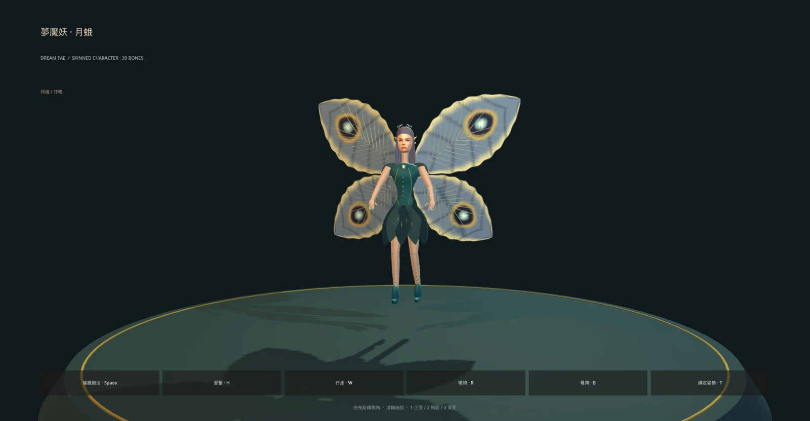

# 第三隻 3D 怪物：夢魘妖・月蛾

後續美術精修的 [2D 角色設計第一版](../../../docs/art/dream-wisp-design-v1/README.md) 已確認製作方向，並建立 [Blender 頭部灰模第一版](../../../docs/art/dream-wisp-sculpt-v1/README.md)。遊戲中現有模型仍是原型，尚未依新設定替換。

沿用既有 `dream_wisp`（夢魘妖）、`dw` 雙怪遭遇與催眠能力。世界設定中它是「靈能凝聚、侵入睡眠的精怪」；這次為它製作人形蛾翼外觀，不變更既有數值、掉落、地圖或劇情。



[人類女性臉部近看](../../../docs/art/dream-wisp-3d-face.webp) · [側臉](../../../docs/art/dream-wisp-3d-profile.webp) · [背面](../../../docs/art/dream-wisp-3d-back.webp) · [施法骨架](../../../docs/art/dream-wisp-3d-rig.webp)

## 外觀與資產

- 小型成年女性人形，柔和人類五官、淡紫長髮、尖耳、細金枝冠與月石飾品；藍綠花瓣衣裝、四片帶眼斑的蛾翼、立體翼脈與邊緣鱗毛。
- 身體綁定高度約 **0.81 世界單位**（哥布林為 2.0），含翼尖約 **0.94**，展翼寬約 **1.1**。動畫讓身體在地面上方約 **0.13** 懸浮，根節點仍代表地面位置。
- **39 根骨骼、10 個材質表面、約 22.9 萬基底三角形**。150 條分束長髮另有完整頭髮表面。Godot 匯入產生 LOD；GLB 約 **19 MB**，優先近看細節，尚未量測大量同屏效能。
- 原創頭部以隱式曲面融合頭骨、下顎、鼻唇與耳朵；臉部基色由內建 **imagegen** 生成，保存為 `textures/fairy_face_albedo.png`（1254² 無損 PNG，PBR 材質例外），並依五官位置投影到頭部。
- 臉部顏色、眼睛、眉毛與唇色包含在材質中；**沒有眨眼、眼球追蹤、表情 blend shapes 或口型動畫**。臉部前向投影已檢查正面與三分之四側面，極端背側由髮型遮蔽；不是完整手工展 UV 的寫實數位人。
- 翅膀用薄的雙面網格和彩繪斑紋，避免透明材質排序；四翼各有獨立骨骼。軀幹與手肘、膝使用漸變蒙皮，其餘飾品／髮束／翼膜以適當骨骼綁定。

## 動作與預覽

| 動作 | 秒數 | 內容 |
| --- | --- | --- |
| `idle` | 2.6 | 懸浮、四翼拍動、頭髮及裙片微動 |
| `walk` | 0.72 | 身體前傾，雙腿向後收，翼拍推進 |
| `attack` | 0.58 | 雙手抬起催眠施法、手側微光隨動 |
| `hit` | 0.32 | 後仰、收翼；遊戲驅動疊加獨立紅閃 |
| `RESET` | 靜態 | 綁定姿勢 |

動畫以 60 Hz 烘焙，執行期沿用 `MonsterModel`。根節點不受動畫位移，世界層控制移動及朝向；既有西南野地 `dw` 遭遇、大地圖和戰鬥直接使用同一模型。

```sh
./run.sh res://presentation/monsters/dream_wisp_preview.tscn
./run.sh res://presentation/monsters/dream_wisp_face_preview.tscn
```

拖曳旋轉／滾輪縮放；Space 催眠施法、H 受擊、W 飛行、R 環繞、B 骨架、T 綁定姿勢；1／2／3 正面／側面／背面。

## 重建

已保存頭部中間網格與臉部材質，一般重建不需重新生圖或 Python：

```sh
godot --headless --path . --script tools/build_dream_wisp.gd
godot --headless --path . --import
```

修改頭部形狀時，使用 `tools/requirements-goblin.txt` 的 Python 依賴執行：

```sh
python tools/sculpt_fairy_head.py
```

`dream_wisp.glb.import` 保留無損內嵌圖片、LOD、完整動畫軌與 `tools/import_monster.gd`，後者明確啟用頂點彩繪色並設定動畫循環，讓蛾翼眼斑匯入後仍可見。GLB 內嵌所有遊戲所需貼圖，不依賴使用者目錄中的生圖檔案。

## 驗證與文件圖片

```sh
godot --headless --path . -s addons/gut/gut_cmdln.gd -gconfig= -gtest=res://tests/presentation/test_dream_wisp_model.gd -gexit
godot --headless --path . -s addons/gut/gut_cmdln.gd -gexit
```

七項測試涵蓋尺寸、四翼骨架、三角面朝向、貼圖與彩繪、蒙皮／inverse bind、懸浮與循環首尾、實際翼膜變形、受擊中斷與實例隔離，以及既有遭遇／戰鬥整合。

預覽場景支援 `--capture /tmp/fae.png --yaw 0.22 --pose idle`，也支援 `--pitch`、`--distance`、`--bones`、`--compare goblin`。臉部細節用 face preview；PNG 原圖放 `/tmp`，文件圖片以 `cwebp -q 88 -resize 1600 0` 轉為 WebP。

## 臉部材質的生成來源

使用內建 `image_gen.imagegen`，不是 CLI／外部下載。生成後將原檔複製到專案 `content/monsters/models/textures/fairy_face_albedo.png`。原始輸出僅作留存，模型重建只使用專案內檔案。

完整最終提示詞：

```text
Use case: stylized-concept. Asset type: front-projected albedo texture for an original 3D female fairy head in a semi-realistic Dungeons & Dragons / Baldur's Gate 3 inspired CRPG. Generate ONE square 1024x1024 facial base-color texture, not a character illustration. A strikingly beautiful ADULT human woman's face viewed perfectly straight on, orthographic, centered and symmetrical, refined soft oval shape, naturally proportioned almond eyes with muted violet irises, gracefully arched eyebrows, slender elegant nose, soft full rose lips closed in a serene neutral expression. Smooth warm ivory skin with subtle natural blush and fine pores; delicate tasteful eye definition. Hair pulled completely away and invisible, no hair on face, no ears, no jewelry, no neck, no costume. The entire image is skin-colored; frontal face fills it, with ample bare forehead at the top and chin at the bottom. Texture alignment: pupils approximately at x32% and x68%, y44%; nose tip centered y62%; closed lips centered y74%; chin bottom y92%. Diffuse flat even shadowless lighting suitable for albedo texture, absolutely no cast shadows, no directional highlights, no strong ambient occlusion. Human beauty and realistic facial anatomy, not doll, not cartoon, not anime, no exaggerated cheekbones, no fantasy ridges. No text, borders, labels, watermark, grid, collage or multiple views.
```
