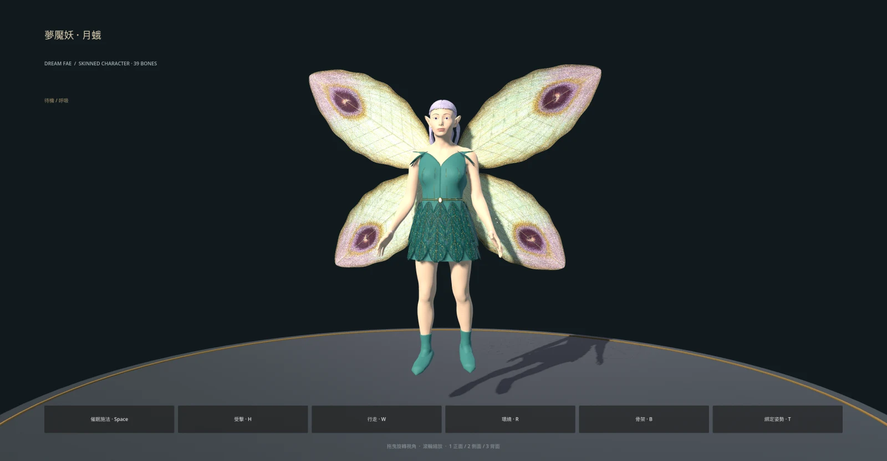

# 夢魘妖・月蛾：完整遊戲資產第一版

已將核定的 [2D 設計](../../../docs/art/dream-wisp-design-v1/README.md) 做成全身 3D 角色，替換先前原型，沿用既有 `dream_wisp`、`dw` 雙怪遭遇與催眠能力。模型已接入大地圖與戰鬥；數值、掉落和劇情不變。



[Blender 全身](../../../docs/art/dream-wisp-production-v1/fullquarter.webp) · [Blender 臉部](../../../docs/art/dream-wisp-production-v1/face.webp) · [Godot 臉部](../../../docs/art/dream-wisp-production-v1/game-face.webp) · [背面](../../../docs/art/dream-wisp-production-v1/game-back.webp) · [施法骨架](../../../docs/art/dream-wisp-production-v1/game-attack.webp)

## 成品

- 成年女性人形，真正立體的眼眶、鼻唇、尖耳；獨立眼球／虹膜／瞳孔，淡紫髮束、細金枝冠與月石。
- 貼身藍綠衣身、三層 36 片刺繡裙片、不透明內襯、肩片與短靴。四片雙面蛾翼各有獨立骨骼、眼斑貼圖與幾何翼脈。
- 身體約 0.81 世界單位高，含翼尖約 0.93，展翼約 1.05；動畫懸浮約 0.13，根節點保持地面位置。
- **39 根骨骼、12 個材質網格、187,726 個基底三角形、GLB 約 19 MB**。包含皮膚、頭髮、絲布、刺繡、金屬與眼睛材質；貼圖全部內嵌，匯入產生 LOD。
- 皮膚為頂點彩繪，微法線、虹膜有 UV；頭髮與裙片有 UV。這版不再使用人臉照片的正面投影。

這是可直接遊玩的第一版。髮型仍採實體髮束，服裝為建模形體；沒有表情 rig、眨眼、口型、逐指動作或布料模擬。它不是完整手工高模雕刻、全身重拓樸及高模法線烘焙的 AAA 角色；不要將來源檔的細節量或渲染圖當成該品質流程已全部具備。

## 動作與預覽

| 動作 | 秒數 | 內容 |
| --- | --- | --- |
| idle | 2.6 | 懸浮、四翼拍動、髮束與裙片微動 |
| walk | 0.72 | 飛行前傾、雙腿後收 |
| attack | 0.58 | 雙手抬起施放催眠 |
| hit | 0.32 | 後仰收翼，遊戲驅動獨立紅閃 |
| RESET | 靜態 | 綁定姿勢 |

動畫以 60 Hz 烘焙。執行期沿用 `MonsterModel`，攻擊可被受擊中斷，實例共用網格但維持獨立動畫與閃光。

```sh
./run.sh res://presentation/monsters/dream_wisp_preview.tscn
./run.sh res://presentation/monsters/dream_wisp_face_preview.tscn
```

拖曳旋轉、滾輪縮放；Space 施法、H 受擊、W 飛行、R 環繞、B 骨架、T 綁定姿勢；1／2／3 正面／側面／背面。妖精預覽使用自己的方向光棚燈設定，遊戲場景仍使用各場景照明。

## 可編輯檔案與重建

- [美術來源](../../../art_source/dream_wisp/production/dream_wisp_art.blend)：分件網格、服裝厚度、曲線飾品、UV、材質與攝影機。
- [遊戲骨架來源](../../../art_source/dream_wisp/production/dream_wisp_rigged.blend)：遊戲精度網格、39 骨骼、蒙皮與 NLA 動畫。
- [製作說明](../../../art_source/dream_wisp/production/README.md)：重建命令、CC0 人體基底來源及各工具責任。
- `dream_wisp.glb`／`dream_wisp.tscn`：實際遊戲載入資產。

已保存的中間 GLB 與 manifest 可以直接重建遊戲骨架，不必重新生成圖片：

```sh
godot --headless --path . --script res://tools/build_dream_wisp.gd
godot --headless --path . --import
```

## 驗證與效能

完整測試 **1170 / 1170 通過**。其中八項妖精資產測試覆蓋尺寸、朝向、材質、四翼、蒙皮與 inverse bind、循環、根節點、實際頂點變形、指尖綁定、施法皮膚邊長異常拉伸、受擊中斷、實例隔離與世界／戰鬥整合。另檢視待機、飛行、施法、受擊、背面及臉部實際渲染。

Apple M2／Godot 4.7 Compatibility／1280×720／關閉垂直同步／單一方向光含陰影的獨立模型場景，180 幀採樣：

| 同屏數 | 中位幀時間 | P95 幀時間 | 平均 FPS |
| --- | --- | --- | --- |
| 2 | 9.15 ms | 15.56 ms | 105.0 |
| 16 | 44.26 ms | 47.29 ms | 22.7 |

[原始量測](../../../docs/art/dream-wisp-production-v1/benchmark.json)。這不是整個遊戲的 FPS 保證；此版以既有雙怪遭遇與近看細節為主，16 隻同屏的負載仍高，不適合作為大量群怪的效能預算。

```sh
godot --headless --path . -s addons/gut/gut_cmdln.gd -gconfig= -gtest=res://tests/presentation/test_dream_wisp_model.gd -gexit
godot --headless --path . -s addons/gut/gut_cmdln.gd -gexit
godot --path . --script res://tools/benchmark_dream_wisp.gd -- /tmp/dream-wisp-benchmark.json
```
