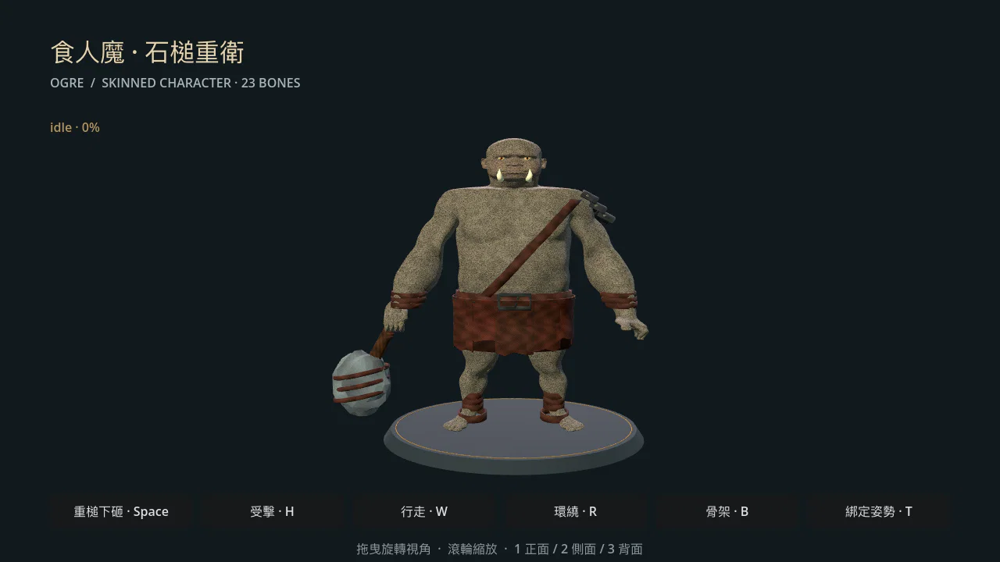

# 食人魔・石槌重衛

第四隻 3D 怪物，也是第一隻從設計卡開始使用[共用量產流程](../../../docs/monster-production.md)製作的新物種。以 CC0 男性人體基底重塑厚重軀幹、短腿、寬下顎與粗前臂，右手持石槌、左肩披暗鐵護甲。



## 遊玩與預覽

西南野 `wild_sw` 的 `(11, 10)` 放置一組 `o` 食人魔遭遇，單隻。沿用原有 `ogre.tres` 能力值、抗性與掉落。大地圖使用 `MonsterModelCatalog`，進入戰鬥借用原有模型，逃跑後仍保留同一實例。

```sh
python3 tools/monster_pipeline.py preview --monster ogre
# 或
./run.sh res://presentation/monsters/ogre_preview.tscn
```

拖曳環繞、滾輪縮放；`1/2/3` 正／側／背；`Space` 舉槌下砸、`W` 行走、`H` 受擊、`B` 骨架、`T` 綁定姿勢。

[大地圖](../../../docs/art/ogre-production-v1/game-world.webp) · [實際戰鬥](../../../docs/art/ogre-production-v1/game-combat.webp) · [舉槌](../../../docs/art/ogre-production-v1/ogre-attack.webp) · [行走](../../../docs/art/ogre-production-v1/ogre-walk.webp) · [骨架](../../../docs/art/ogre-production-v1/ogre-rig.webp)

## 資產與驗收

| 項目 | 結果 |
|---|---|
| 綁定尺寸（寬 × 高 × 深） | 3.35 × 3.14 × 1.23 世界單位，含石槌 |
| 基底三角形 | 44,794；匯入時生成 LOD |
| 骨架／材質 | 23 根／7 種，四槽蒙皮權重 |
| GLB／最大貼圖 | 8.16 MiB／1254，貼圖無損內嵌 |
| 動作 | idle 2.6s、walk 0.72s、attack 0.58s、hit 0.32s、RESET |
| 技術檢查／暫定預算 | 0 錯誤／0 警告，`--strict-budgets` 通過 |
| 16 隻獨立渲染 | Apple M2、1280×720、Compatibility、LOD 開啟：P95 29.56 ms |
| 回歸 | 1,244 個 GUT、9 個 Python 工具測試通過；內容檢查 0 錯誤 |

詳細環境、每組負載、逐幀資料與視覺紀錄見[驗收紀錄](../../../docs/art/ogre-production-v1/README.md)。效能數字屬獨立資產場景，不代表完整遊戲 FPS。全套 GUT 退出時仍有既有音樂資源洩漏訊息，測試斷言皆通過。

腳底原點、+Z 朝前，角色高度約哥布林的 1.57 倍。石槌與握持手綁定右手骨；手臂以焊接 UV 邊界後的網格連通區分離，再沿肩膀表面平滑權重，避免粗前臂被腹部骨骼拉住。步態由離線雙節 IK 解算並烘焙，執行期只播放骨骼動畫。

模型保留半寫實基底與程序化衣裝特徵，沒有表情 blend shapes、手指控制器或手工重拓撲。大型怪物近距離舉槌時，槌頭會超出玩家視野上緣；[戰鬥攻擊畫面](../../../docs/art/ogre-production-v1/game-combat-attack.webp)保留此實際結果，後續鏡頭／動作美術審查可據此調整。

## 來源與重建

[設計卡](../../../art_source/ogre/production/DESIGN.md) · [可編輯來源與完整重建指令](../../../art_source/ogre/production/README.md) · [授權與 imagegen 完整提示詞](../../../art_source/ogre/production/PROVENANCE.md)

交付 `ogre_base.blend`、`ogre_art.blend`、`ogre_geometry.glb`、`geometry_manifest.json`、無損 PBR 圖與 `ogre_rigged.blend`。人體使用 Dan Ulrich 的 Blender Human Base Meshes CC0 基底；概念圖與皮膚細節使用內建 imagegen，完整提示詞和保存位置均記錄於來源文件。

```sh
# 一般動畫／權重重建，使用已入庫的遊戲幾何：
godot --headless --path . --script tools/build_ogre.gd
godot --headless --path . --import
python3 tools/monster_pipeline.py review --monster ogre --strict-budgets
```

修改比例、裝備或材質時，先執行 Blender `build_ogre_art.py`；改完 GLB 後再用 `package_monster_rig.py --monster ogre` 更新可編輯骨架副本。
