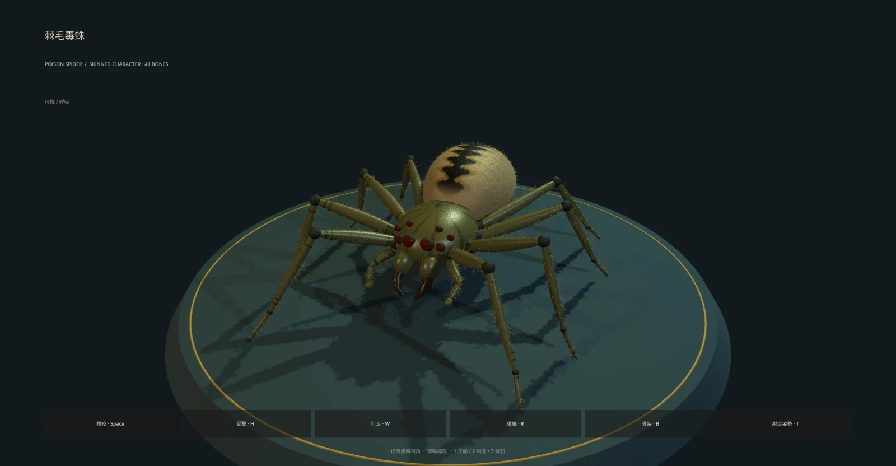

# 第二隻 3D 怪物：棘毛毒蛛

接到既有 `poison_spider`（毒蛛）與 `ps` 遭遇組。大地圖和戰鬥使用相同的 `poison_spider.glb`，不改怪物能力值、掉落或遭遇配置。



## 外觀與尺寸

- 原創程序化小型八足怪物；+Z 朝前、腳尖原點，最高處含細毛約 **0.65 世界單位**，約哥布林高度的三分之一。八足展寬約 **1.56**、前後約 **1.63**，維持低矮的物種比例。
- 橄欖褐頭胸甲、金褐腹部、深色葉狀背紋、關節環紋、八顆深琥珀眼、成對彎曲毒牙、口旁觸肢、後腹紡器與雙爪腳尖。
- **3,554 根立體細毛／感覺棘**，不使用透明毛片。三張 512² 微表面貼圖（色彩、法線、粗糙度）在 GLB 內嵌；宏觀斑紋用頂點彩繪。
- 基底網格約 **15.6 萬三角形、7 個材質表面**；GLB 約 **14 MB**。Godot 匯入產生 LOD；多隻共用網格、貼圖和動畫。此版本優先近看細節，尚未做大量毒蛛同屏的效能量測。

[背部細節](../../../docs/art/poison-spider-3d-back.webp) · [撲咬骨架](../../../docs/art/poison-spider-3d-rig.webp) · [與哥布林等比例比較](../../../docs/art/poison-spider-3d-scale.webp)

## 骨架與動作

41 根骨骼：root、body、abdomen，八足各 femur／tibia／tarsus／foot，兩側 fang、palp、palp_tip。硬質分節外骨骼以單骨權重綁定，每頂點保留四槽位與有效 inverse bind；不是軟體動物的跨關節平滑皮膚，也沒有 DCC 操控器或表情 blend shapes。

| 動作 | 長度 | 行為 |
| --- | --- | --- |
| `idle` | 2.6 秒 | 身體微幅起伏、腹部與觸肢活動，八足維持地面接觸 |
| `walk` | 0.72 秒 | 左右交錯四足步態，支撐半週往後、抬足半週向前 |
| `attack` | 0.58 秒 | 前足抬起、身體前探、雙毒牙開合 |
| `hit` | 0.32 秒 | 身體壓低後縮，遊戲驅動疊加獨立紅閃 |
| `RESET` | 靜態 | 綁定姿勢 |

離線兩節 IK 求解足部接觸與固定肢段長度，以 60 Hz 烘焙成 glTF 動畫。執行期使用共用 `MonsterModel` 的 AnimationPlayer；沒有執行期 IK。根節點不移動，世界層負責位移與轉向。

## 查看與重建

```sh
./run.sh res://presentation/monsters/poison_spider_preview.tscn

godot --headless --path . --script tools/build_poison_spider.gd
godot --headless --path . --import
```

拖曳旋轉、滾輪縮放；Space 撲咬、H 受擊、W 行走、R 環繞、B 骨架、T 綁定姿勢；1／2／3 正面／側面／背面。與第一隻模型共用可參數化預覽程式。

`poison_spider.glb.import` 必須保留：內嵌圖片模式 3（無損內嵌）、LOD、動畫完整軌、`tools/import_monster.gd`。後者明確啟用 COLOR_0 材質顏色，避免 Godot 4.7 匯入後斑紋消失；使用官方 [EditorScenePostImport](https://docs.godotengine.org/en/stable/classes/class_editorscenepostimport.html) 匯入鉤子。

可重現的文件畫面：

```sh
./run.sh res://presentation/monsters/poison_spider_preview.tscn -- --capture /tmp/spider.png --yaw 0.38 --pitch 0.48 --pose idle
./run.sh res://presentation/monsters/poison_spider_preview.tscn -- --capture /tmp/spider-back.png --yaw 2.65 --pitch 0.65 --pose idle
./run.sh res://presentation/monsters/poison_spider_preview.tscn -- --capture /tmp/spider-rig.png --yaw 0.38 --pitch 0.48 --pose attack --bones
./run.sh res://presentation/monsters/poison_spider_preview.tscn -- --capture /tmp/spider-scale.png --compare goblin --yaw 0 --pose idle
```

PNG 原圖放 `/tmp`；文件預覽以 `cwebp -q 88 -resize 1600 0` 壓縮入庫。`--distance` 可指定攝影機距離做近看檢查。

## 驗證

```sh
godot --headless --path . -s addons/gut/gut_cmdln.gd -gconfig= -gtest=res://tests/presentation/test_poison_spider_model.gd -gexit
godot --headless --path . -s addons/gut/gut_cmdln.gd -gexit
```

測試包含自然尺寸／接地、所有三角形朝向、彩繪材質、蒙皮權重／inverse bind、八足各動作地面接觸與肢段長度、循環首尾、毒牙動作／實例隔離，以及既有毒蛛遭遇與混合哥布林戰鬥整合。
