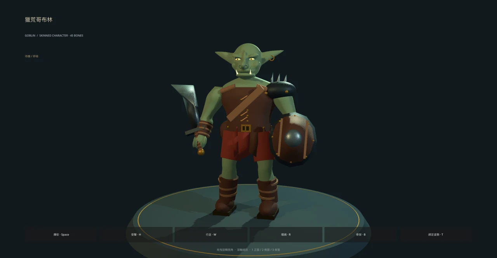

# 哥布林：骨架與蒙皮角色

三種怪物的共用製作入口與驗收規範見 [怪物製作規範與工具 v1](../../../docs/monster-production.md)。執行 `python3 tools/monster_pipeline.py review` 可一次產生驗證、標準截圖與效能報告。所有模型目前使用 `tools/import_monster.gd` 保留彩繪與動畫循環。

第二隻怪物已加入：[棘毛毒蛛：模型、骨架、預覽與重建](POISON_SPIDER.md)。體型約哥布林高度的三分之一，使用相同的遊戲動畫驅動。

第三隻怪物：[夢魘妖・月蛾：人類女性臉部、四翼、懸浮與施法](DREAM_WISP.md)。沿用既有夢魘妖遭遇與催眠能力。

`goblin.glb` 是原創半寫實方向的 3D 哥布林：融合的頭部表面、較小的眼睛與頭身比例、尖耳與獠牙、橄欖灰綠皮膚、皮甲、砍刀與小盾。模型與 PBR 貼圖由專案工具離線產生；遊戲透過 `goblin.tscn` 掛上動畫驅動，大地圖與戰鬥共用同一 GLB。

## 查看

```sh
./run.sh res://presentation/monsters/goblin_preview.tscn
```

- 拖曳環繞、滾輪縮放；`1` / `2` / `3` 查看正面／側面／背面。
- `Space` 揮砍、`H` 受擊、`W` 行走、`R` 自動環繞。
- `B` 顯示穿透骨架；`T` 切換綁定姿勢。畫面按鈕有相同功能。



[骨架與攻擊姿勢](../../../docs/art/goblin-3d-rig.webp) · [背面](../../../docs/art/goblin-3d-back.webp)

## 骨架、蒙皮與動畫

- 45 根具命名與父子階層的 `Skeleton3D` 骨骼：root、骨盆、脊椎、胸、頸、頭、下顎、耳、鎖骨、上臂／前臂／手、雙手各五指兩節、大腿／小腿／腳／腳趾。
- 真正的 `Skin` inverse bind 與頂點骨骼權重；每頂點四個槽位，目前最多兩根骨骼混合。肩、肘、腕、膝與踝有漸變權重。手臂與腿部各有跨關節的連續網格。
- 砍刀與盾牌完整綁到手骨；肩甲維持單骨硬質變形。頭部與衣物以分件表面交疊組裝，並非全身單一流形拓撲。
- GLB 包含 `idle`（2.6 秒）、`walk`（0.72 秒）、`attack`（0.58 秒）、`hit`（0.32 秒）與 `RESET`，可匯入 Blender 等支援 glTF 的工具。
- 朝向 **+Z**、鞋底原點、綁定高度約 **2 世界單位**。動作不移動角色根節點；世界層負責位移與轉向。
- `MonsterModel` 使用 `AnimationPlayer` 播放烘焙骨骼動畫，切換時混合；受擊可中斷攻擊、隱藏時暫停動畫。多隻角色共用網格／貼圖／動畫，各自持有骨骼姿勢與紅閃材質。

這是可在遊戲中使用與繼續編修的程序化角色基底。沒有 DCC 控制器／IK、表情 blend shapes 或手工重拓撲；臉部細節與服裝仍保留風格化處理。

## 重建

一般重建不需要 Python；頭部中間網格已入庫：

```sh
godot --headless --path . --script tools/build_goblin.gd
godot --headless --path . --import
```

修改融合頭部造型時，先在 Python 虛擬環境安裝 `tools/requirements-goblin.txt`，再執行：

```sh
python tools/sculpt_goblin_head.py
```

`sculpt_goblin_head.py` 以隱式曲面及 marching cubes 產生 `goblin_head.meshbin`；`build_goblin.gd` 建立身體與裝備；`goblin_rig.gd` 烘焙骨架、權重、動畫與皮膚／皮革／金屬／布料的色彩、法線和粗糙度貼圖。GLB 包含材質貼圖，匯入設定以無損嵌入方式保存，不額外抽出重複圖片。Godot 匯入時產生 LOD。

## 驗證

```sh
godot --headless --path . -s addons/gut/gut_cmdln.gd -gexit
```

測試包含模型尺寸、完整頂點索引、有效且正規化的蒙皮權重、inverse bind、手肘實際頂點變形、動畫播放與中斷、角色實例隔離，以及戰鬥／大地圖整合。

可重現的畫面擷取：

```sh
./run.sh res://presentation/monsters/goblin_preview.tscn -- --capture /tmp/goblin.png --yaw 0.3 --pose attack --bones
```

`--pose` 接受 idle／walk／attack／hit；省略便是正常待機。擷取原圖放 `/tmp`，文件圖片壓成 WebP 後再入庫。
