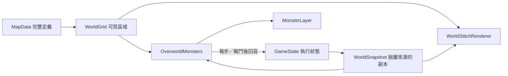

# 地圖定義、執行狀態與渲染快取

世界由三種資料組成，各自只有一個責任：

| 層 | 實作 | 責任 |
| --- | --- | --- |
| 地圖定義 | `MapData`、`MapManager`、`WorldGrid` | 地形、入口、物件與遭遇的完整配置；玩家進度不刪改配置 |
| 執行狀態 | `GameState`、`WorldSnapshot`、`OverworldMonsters` | GameState 持有持久進度；快照提供重建輸入；怪物模擬計算下一步再回寫 |
| 呈現快取 | `WorldStitchRenderer`、`ChestLayer`、`MonsterLayer` | 從定義與狀態產生畫面；快取可以丟棄重建，不是遊戲進度來源 |

## 世界重建

`main._rebuild_world()` 建立可見區域與一份 `WorldSnapshot`，把同一份快照交給寶箱渲染與怪物重建。初始化、轉場、跨圖重定位、讀檔皆走這條路徑。

- `MapManager.enter_map(map_id)` 不接受已清遭遇參數，也不刪除 encounters。焦點地圖與 `peek_map()` 鄰圖都保留相同的配置語意。
- `WorldSnapshot` 複製開箱、已清遭遇、已擊敗 UID 與怪物位置資料；查詢回傳副本，避免渲染與模擬修改來源。
- 遭遇是否存在由原生地圖／home 座標與 UID 的進度決定，當前圖及鄰圖使用同一判斷。怪物位置以原生圖相對座標保存，可在原生圖外；切換焦點時才投影成新的全域座標。
- `SaveSystem.capture_from()`／`apply_to()` 複製世界進度字典，避免後續遊玩改到已擷取或讀入的進度資料。隊伍與背包仍沿用既有序列化流程；`WorldSnapshot` 僅描述世界重建所需的狀態。

## 渲染快取同步

`WorldStitchRenderer.rebuild(regions, snapshot)` 保留仍可見的地形／建築節點，更新區域偏移，再對**所有可見區域**執行 `sync_state(snapshot)`。

`sync_state()` 比較每區已呈現的開箱集合，只重建有變化的 `ChestLayer`。因此讀入較早的存檔時，沿用的鄰區寶箱也會由開恢復成關；沒有變化的寶箱、地形與建築保持原節點。區域離開可見範圍時，容器、定義引用及狀態快取一併清除。

渲染器不直接讀取 GameState，也不持有進度 provider。開箱後由 main 注入新快照。快取假設同一遊戲期間 map_id 對應固定的地形／物件配置；內容熱重載不在這個 API 的範圍內。未來增加可開關的門或可破壞物件，應新增對應執行狀態與動態層同步，不能回頭修改 MapData 或依賴畫面節點判斷遊戲規則。

## 回歸測試

- `test_world_snapshot.gd`：來源與查詢結果隔離、跨地圖狀態判斷。
- `test_world_stitch_renderer.gd`：當前／鄰區讀檔回復、靜態節點沿用、未變寶箱沿用、區域離開再回來。
- `test_overworld_monsters.gd`：完整定義加進度過濾、跨界怪物位置還原。
- `test_save_system_capture_apply.gd`：讀檔不刪地圖配置、世界進度深層隔離。
- `test_main_world_restore.gd`：真正的 SaveSystem.loaded 訊號同步寶箱與怪物，接著跨圖重定位；讀檔選單仍維持第 1 項的輸入控制權。

## 2026-09-09 驗證結果與限制

Godot 4.7：完整 186 個腳本、1,198 項測試、5,217 個 assertions 全部通過，程序退出碼 0。測試結束仍有基線既存的 4 個 ObjectDB／2 個 resource 清理訊息。

實際渲染主場景的 7 項檢查均通過：鄰區開箱、讀檔關箱、地形節點沿用、讀檔選單持有輸入、跨圖後維持關箱、完整遭遇定義、讀檔後轉場完成。但渲染程序在退出時出現 `recursive_mutex lock failed: Invalid argument`，退出碼 134；前次架構 review 的基線重現也有相同例外。本次修正沒有解決此原生退出問題，不能將這次渲染檢查記為正常退出。
