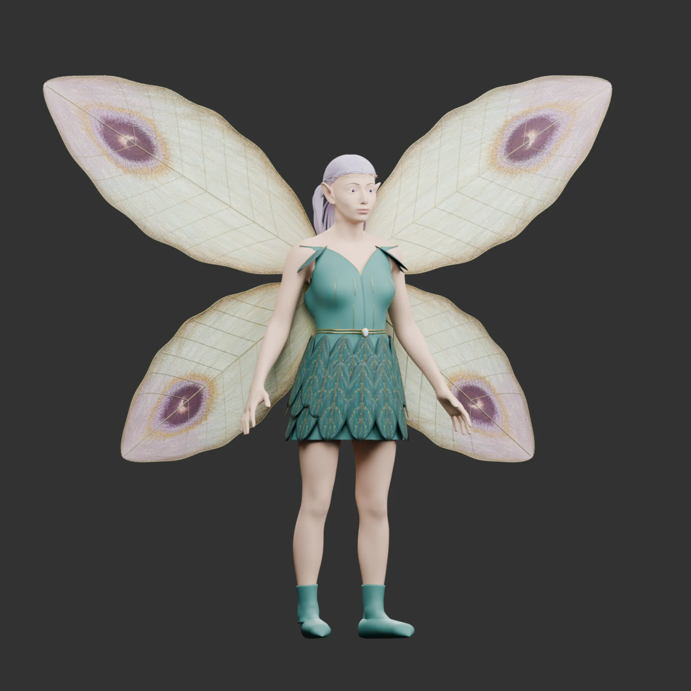

# 夢魘妖製作結果第一版

`fullfront`、`fullquarter`、`fullback`、`face` 是真正的 Blender Cycles 渲染；`game-*` 是 Godot Compatibility 的實際遊戲網格與動畫畫面。沒有使用 AI 圖片替代 3D 成品預覽。

[臉部](face.webp) · [遊戲預覽](game-front.webp) · [施法骨架](game-attack.webp) · [飛行](game-walk.webp) · [受擊](game-hit.webp) · [背面](game-back.webp)

成品的材質、動作、重建及效能限制見 [完整說明](../../../content/monsters/models/DREAM_WISP.md)。
