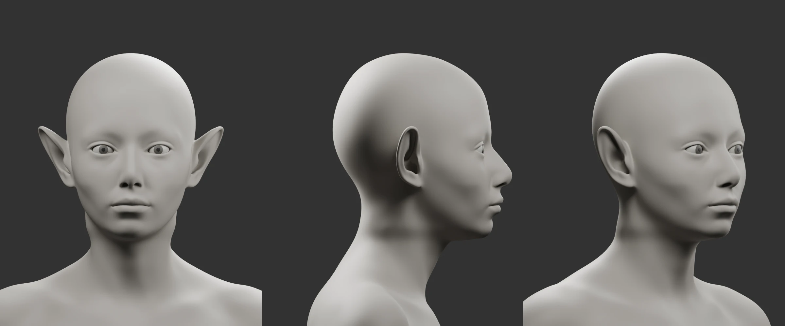

# 夢魘妖：頭部灰模第一版

沿用已確認的 [角色設計圖](../dream-wisp-design-v1/README.md)，建立可編輯的真實 3D 頭部造型。以下圖片均由 Blender 中同一模型與同一套燈光渲染，未使用 imagegen 生成灰模圖。

[正面](head-front.webp) · [90° 側面](head-profile.webp) · [45°](head-threequarter.webp) · [背面](head-back.webp)

## 製作內容

- 從 Blender Studio 的 CC0 女性基礎網格擷取頭頸，保留真實眼眶、眼瞼、鼻翼、嘴唇、口腔及耳廓結構。
- 調整五官比例、下顎、眼型、鼻樑與鼻翼，並將耳朵局部延伸為尖耳。
- 獨立眼球與灰色虹膜／瞳孔幾何；全模型只有均勻材質色，沒有臉部圖片或法線貼圖。
- `.blend` 保留可調整的造型 shape keys、細分曲面、四台正交相機及打包參考圖。
- 控制網格檢查沒有零面積面或非邊界的非流形邊。下方胸頸切口與虹膜片邊界為預期開口；檢查不代表造型或動畫已達成品標準。

## 檔案

- [可編輯 Blender 製作檔](../../../art_source/dream_wisp/head_v1/dream_wisp_head_v1.blend)
- [靜態 GLB 預覽快照](../../../art_source/dream_wisp/head_v1/dream_wisp_head_v1.glb)
- [製作／重建說明與 CC0 來源](../../../art_source/dream_wisp/head_v1/README.md)
- [網格檢查結果](../../../art_source/dream_wisp/head_v1/validation.json)

## 目前判讀

本版建立了可轉動、可修改的頭部基礎；與設計圖仍有距離，尤其是眼瞼曲線、鼻尖與鼻唇關係、嘴角及下顎的細微形狀。尚未將本版視為頭部最終定稿。

後續應繼續對照設計圖精修上述部位，再加入髮型與眉毛確認角色辨識度。頭髮、服裝、翅膀、UV／烘焙、皮膚材質及表情動畫仍屬後續階段。現有遊戲角色沿用原型資產。
