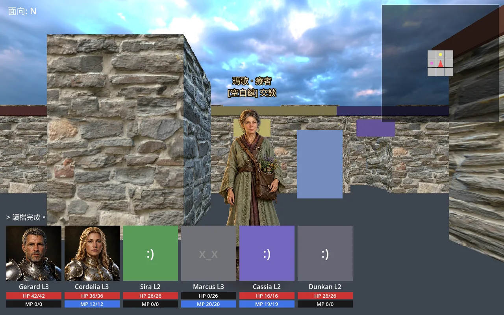
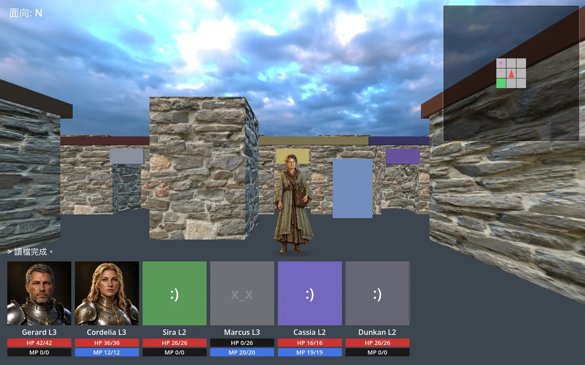

# NPC 範例：療者瑪歌

> 狀態：第一版已接入正式地圖，透明素材、近遠距離畫面與任務互動已驗證。

瑪歌是第一位地圖 NPC 立繪範例。她在橡鎮井旁（`town_oak` 的 `[8, 8]`），沿用正式對話 `qg_margo` 與「毒澤的解藥」任務 `oak_antidote`。

## 第一版範圍

- 去背全身立繪，面容與既有 `content/scenes/margo_portrait.webp` 對齊；灰綠長袍、紫色領巾、草藥袋。
- 固定 Y 軸面向鏡頭，維持直立；四秒左右一次微幅呼吸，腳底固定。
- 地面柔和橢圓接觸陰影，獨立於呼吸，不烘焙在角色圖裡。
- 玩家在正前方一格時顯示「瑪歌 · 療者／[空白鍵] 交談」。離開、轉身、對話或開啟選單時隱藏。
- `blocks: false`：保留 NPC 可穿越行為；走進或穿過該格不會自動開啟對話。站在相鄰格、面向 NPC，明確按下空白鍵才交談。
- NPC 交談統一使用空白鍵；阻擋型 NPC 被碰撞時也不自動交談。移動／轉向中、按住鍵的重複事件，以及其他介面持有輸入時不啟動。
- 對話仍使用原肖像與情境圖；小地圖沿用既有任務 NPC 標記。

這是固定站位的 2.5D 範例；繞到背後仍看見正面。行走、工作動作、多方向立繪、依任務進度變化的圖示，另行擴充。

## 實際畫面

一格距離，顯示交談提示；近距離下半身會被既有隊伍 HUD 遮住：



兩格距離，提示隱藏，可檢查全身輪廓、腳底與接觸陰影。背景其他 NPC 尚為原有佔位圖：



## 直接預覽

在專案根目錄執行：

```sh
godot --path . --script res://tools/npc_preview.gd
```

工具開啟正式主場景，把玩家放在瑪歌南側 `[8, 9]`，朝北。按空白鍵交談；數字鍵選擇選項。W 或上方向鍵只移動，可直接穿過瑪歌。可退後、轉身檢查提示距離與角色剪影。不讀寫存檔槽，也不改正式遊戲的起始地圖。

擷取正式場景並驗證對話：

```sh
godot --path . --script res://tools/npc_preview.gd -- --capture=res://build/npc-margo.webp --verify-dialogue
```

兩格距離的全身預覽可加 `--distance=2`；支援 1–4 格。`--verify-dialogue` 須保持一格距離：

```sh
godot --path . --script res://tools/npc_preview.gd -- --distance=2
```

純邏輯驗證可使用 headless；截圖需有渲染視窗：

```sh
godot --headless --path . --script res://tools/npc_preview.gd -- --verify-dialogue
```

`NPC_DIALOGUE_OK: margo` 表示：走進 NPC 格不自動交談、退回相鄰格後空白鍵開啟對話、鎖住探索輸入、接受任務、關閉對話並恢復探索，以及沿同方向穿過 NPC 全部通過。此流程直接操作正式主場景的按鍵處理、PlayerController 與 DialogueOverlay。

## 複用到下一位 NPC

1. 準備角色設定與既有肖像，依 [美術指南](../art-style-guide.md) 製作同風格的透明全身圖。保留足底留白的數值，勿把棋盤格當作透明背景。
2. 壓成保留 alpha 的 WebP，放在 `content/npcs/<id>/idle.webp`。若使用第二幀，構圖、大小和腳底位置必須一致；單幀已可使用呼吸，不必強行生成第二幀。
3. 在 `presentation/world/npc_sprite_catalog.gd` 的 `_SPRITES` 加入貼圖與展示資料：

```gdscript
"margo": {
    "idle": "res://content/npcs/margo/idle.webp",
    "name": "瑪歌",
    "role": "療者",
    "height": 1.72,
    "foot_ratio": 0.985,
    "shadow_width": 0.9,
},
```

`height` 是整張畫布的世界高度；`foot_ratio` 是鞋底基準由圖片頂端算起的高度比例。角色根節點在地面，立繪中心高度為 `height × (foot_ratio − 0.5)`，呼吸時同步補償，避免腳底浮動。`shadow_width` 以世界單位表示；每格寬 2 單位。

4. 在地圖的 `entities` 中加入一筆，沿用既有地圖與對話系統：

```json
{"type": "questgiver", "pos": [8, 8], "dialogue": "qg_margo", "sprite": "margo", "blocks": false}
```

新對話、任務、地圖若尚未登記，須依 `content/registry.json` 的現有慣例登記。NPC 立繪以 `NpcSpriteCatalog` 登記，不新增另一套內容查找機制。

5. 匯入素材，預覽指定 NPC；工具會找相鄰可站立格面向他：

```sh
godot --headless --path . --import
godot --path . --script res://tools/npc_preview.gd -- --npc=margo --map=town_oak
```

## 驗收

- 真透明 alpha：輪廓外透明，衣袍與臉部不被挖空；縮小、貼近檢查頭髮與鞋底。
- 正面一格、兩格、側面轉向；無懸空、整片底色或紙片傾倒。
- 正前方一格出現提示，轉身或退後隱藏；提示受場景深度遮擋。
- 開關對話與選單，探索提示不與介面重疊。
- 走進或穿過 NPC 格不交談；正前方一格按空白鍵才交談。接受任務後返回探索並可繼續穿過該格；可再次按空白鍵交談。
- 切圖、重建或讀檔不重複生成角色、陰影與標籤。

## 素材來源

使用內建 `image_gen`，參考現有瑪歌肖像。完整生成與透明背景修正 prompt 保存在 [margo-prompts.json](margo-prompts.json)。生圖回傳的 RGB 棋盤格經使用者同意，改以本機 rembg 去背；處理方式與固定依賴的重建腳本見 [素材來源](../../art_source/npcs/margo/README.md)。

正式素材：1024 × 1536 RGBA WebP、q85、184,176 bytes；alpha 非零範圍 `[222, 11, 834, 1513]`，腳底比例 `1513 / 1536 ≈ 0.985`。無額外原始 PNG 或模型權重進入 repository。

## 本次驗證結果

- GUT：195 個測試腳本、1,260 項測試全部通過。新增 sample 素材非空、真 alpha、腳底位置及提示隱藏的檢查。
- 空白鍵互動變更：`test_main_flow.gd` 的 17 項測試全部通過，包含穿越不自動交談、面向／距離、按鍵重複／放開、轉向中、選單鎖定與阻擋型 NPC 的驗證。
- 正式渲染預覽：一格／兩格截圖均已檢視；無棋盤背景、懸空或紙片傾斜。
- `--verify-dialogue`：走進 NPC 格不自動交談、空白鍵交談、接受解藥任務、返回探索並繼續穿過 NPC 均通過；預覽工具退出無錯誤。
- 完整 GUT 程序退出時仍出現資源未釋放訊息（4 個 ObjectDB／2 個 resources）；測試斷言全部通過。本次沒有修改全專案的資源生命週期。

## 實作位置

| 檔案 | 用途 |
| --- | --- |
| `content/npcs/margo/idle.webp` | 正式透明全身素材 |
| `presentation/world/npc_sprite_catalog.gd` | 素材與角色展示設定 |
| `presentation/world/npc_layer.gd` | 立繪、呼吸、貼地定位、靠近提示 |
| `presentation/world/npc_contact_shadow.gdshader` | 不依賴圖片的柔和接觸陰影 |
| `tools/npc_preview.gd` | 正式地圖預覽、截圖與互動驗證 |
| `art_source/npcs/margo/prepare.py` | 從保留的全身來源重建正式 alpha WebP |
| `tests/presentation/world/test_npc_layer.gd` | 位置、重建、腳底固定與提示條件測試 |
