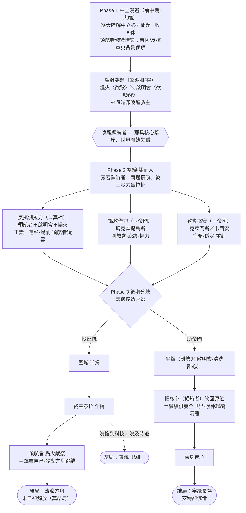

# 世界觀參考骨架（World Reference）

> **本檔定位**：`docs/world-bible.md`（canon 正本）之下的**全貌查詢骨架**。把聖經 §13 留白的子系統補成「名號＋定義＋關係＋與機制／章節對應」的 outline，當作日後所有劇本／任務／地圖／NPC 的查詢表。
> **與正本的關係**：本檔**不改 canon 脊樑**；凡會動到 canon 的拍板決定，已同步回寫進 `world-bible.md` 對應節，本檔只做展開。如有衝突，以 `world-bible.md` 為準。
> **深度**：outline——只列骨架，不寫場景對白；具體事件／對白留待寫劇本時細定。
> **專名**：除既定 canon（泰拉／皓月／造物主／皓月帝國／皓月教會／啟明會／燼火／三學派／創世號／領航者．聖露希亞）外，本檔新增人名／地名**皆為暫名〔可改〕**。
> **狀態**：2026-06-28 首版（全貌骨架）。

---

## A. 勢力人物與恩怨網

> 對接 bible §7。原則：帝國—教會是壓迫秩序的兩根柱子，底下多方摩擦＝近景事件的養分。命名走「中文俗名＋拉丁聖號」。**第一章橡境五位（卡西安／哈洛／多恩／伊利安／瑪歌）的深寫細節檔見 A.8；全政治盤面＋領航者的「決策模型」（推演行動用）見 A.9；核心人員全名冊（25 位）見 A.10；A.10 新增 12 位的個性側寫見 A.11。**

### A.1 皓月帝國（Imperium Lunae）

- **當朝皇帝**：〔皓月之子·賽弗里安二世（Filius Lunae Severianus II）〕，俗稱**「白燼皇帝」**。合法性來自教會加冕，實權旁落——**偏向被供奉的象徵**，是「皇權受制於神權」的活招牌。
- **帝國攝政／實權者**：〔鐵相·瑪克森提烏斯（Maxentius）〕，職銜**「執戈大臣」**。實際掌軍政官僚機器，**對教會的越權早有積怨**——這道「帝—教裂隙」是反抗者與玩家可利用的接點（他不在乎真相，只想要權）。
- 立場：對外擴張剝削、對內高壓；但內部「皇權 vs 神權」的張力是可被撬動的縫。

### A.2 皓月教會（Ecclesia Lunae）

- **當代皓月聖座（Luminarch）**：〔克萊門斯七世（Clemens VII）〕——名為「克萊門斯（仁慈）」卻坐鎮一部殘酷神權機器，**世界最深的權力**、科技禁忌與靈能正統的最終裁決者。遠在聖城，後期才正面交鋒。
- **外勤審判官（Inquisitio）**：〔審判官·卡西安（Cassian），別號**「灰燭」**〕——第一章即過境邊陲緝拿異端的冷面執法者，**貫穿前期的可復現反派**：他的清洗逼玩家站隊、與燼火結緣。
- **正統 vs 異端**：正統教廷守禁忌、護神話、與帝國共構壓迫；**啟明會**（見 A.3）是教會體內偷看真相的異端密儀，被審判庭獵殺。

### A.3 啟明會／守燈人（Lampadarii）

- **接頭人**：〔持燈者·伊利安（Elian）〕——一名被褫奪聖職、暗中私研「遺物」的前教士，**懷疑「皓月之神」是假神**。史詩長弧接回日常的關鍵接點：前期遞線索，**中後期領玩家走向喚醒領航者**（第四章重罪異端）。各懷鬼胎的灰色盟友，非全然可信。

### A.4 反抗組織：燼火（the Ember）

- **領袖**：代號**「餘燼（the Last Coal）」**——被神秘化的精神象徵，可能非單一人、可能早已殉難只剩名號。最初純政治（反暴政苛稅、反審判清洗），與真相無關。
- **橡鎮在地分舵接點**：〔鐵匠·多恩（Dorn）〕——晨橡村／橡鎮一帶的燼火細胞，玩家最自然的反體制入口。
- 走向：隨劇情可與啟明會、離心領主合流；覺醒後成為「破禁忌、動科技」的同盟。

### A.5 靈能三學派代表（詳見 C 節）

- **求是院**：〔祭酒·歐德蘭（Audran）〕——務實、實驗、由世俗領主供養，**最容易擦邊禁忌、意外踩進真相**。
- **靜默隱修會**：〔緘默者·瑟雷恩（Therein）〕——隱世苦修、**藏有古老祕密**（可能握有「聖髑＝沉睡軀體」的碎片線索）。
- **濟世會**：〔遊方療者·瑪歌（Margo）〕——親民清貧、最得民心，**邊陲早期最自然的盟友**（對接神殿治療）。

### A.6 世俗領主：橡境伯

- 〔**橡境伯·哈洛·灰木**（Margrave Harlow Greywood）〕——管轄晨橡村／橡鎮一帶的**離心邊境領主**：天高皇帝遠、重生存秩序更甚教義，**最可能暗通燼火**。第一章「領主苛政 vs 暗護鄉里」的灰度都出在他身上。

### A.7 勢力關係矩陣

> **自洽原則**：關係由各勢力的**核心目標**推導——目標衝突＝敵對、目標重疊＝結盟、同陣營爭權＝內部張力。先列目標（A.7.1）作為根據，再給矩陣（A.7.2），最後補理由與不對稱（A.7.3）。

#### A.7.1 勢力清單與核心目標（矩陣的自洽根據）

| # | 勢力 | 核心目標 | 對禁忌／真相 |
|---|---|---|---|
| 1 | **帝國皇權**（皇帝賽弗里安二世） | 保住合法統治與皇位 | 守禁忌（合法性所繫） |
| 2 | **帝國攝政派**（鐵相瑪克森提烏斯） | 鞏固世俗實權、削神權掣肘 | 務實守禁忌（暗自覬覦可用之力） |
| 3 | **皓月教會**（含審判庭，聖座克萊門斯） | 神權至上、壟斷靈能正統、守科技禁忌 | 禁忌的最高守護者 |
| 4 | **親王派領主**（霜冠公、綠洲總督…） | 靠帝國—教會特許保住封地 | 堅定守禁忌 |
| 5 | **啟明會**（守燈人） | 私探真相（神是假神、遺物＝科技） | 暗中破禁忌求知 |
| 6 | **燼火**（反抗組織） | 推翻帝國—神教壓迫秩序 | 政治先行，覺醒後願破禁忌 |
| 7 | **離心邊境領主**（橡境伯哈洛…） | 邊境自保、重生存秩序甚於教義 | 對禁忌務實鬆動 |
| 8 | **求是院** | 拓展靈能知識、自由求知 | 最易擦邊禁忌 |
| 9 | **靜默隱修會** | 內在苦修、守古老祕密 | 守祕重於守禁忌 |
| 10 | **濟世會** | 以靈能療癒服務平民 | 不涉禁忌之爭 |
| 11 | **盜遺者行會** | 盜掘走私遺物牟利 | 為財公然踩禁忌 |
| 12 | **商人同盟** | 跨領地流通牟利 | 不問立場、只問利 |
| 13 | **覺醒智能怪部族** | 自治存續 | 不在乎人類禁忌 |

#### A.7.2 關係矩陣（對稱）

> 符號：**◎**同盟　**○**同情／合作　**△**交易／曖昧（互利提防）　**・**中立／互不相干　**▽**內部張力／競爭　**✕**敵對　**⊗**死敵（獵殺／你死我活）

| | 1 | 2 | 3 | 4 | 5 | 6 | 7 | 8 | 9 | 10 | 11 | 12 | 13 |
|---|---|---|---|---|---|---|---|---|---|---|---|---|---|
| **1 皇權** | — | ▽ | ◎ | ◎ | ✕ | ⊗ | △ | ・ | ・ | ・ | ✕ | △ | ✕ |
| **2 攝政** | ▽ | — | ▽ | ◎ | ・ | ✕ | △ | △ | ・ | ・ | ✕ | △ | ✕ |
| **3 教會** | ◎ | ▽ | — | ◎ | ⊗ | ⊗ | ▽ | ▽ | ・ | ・ | ✕ | △ | ✕ |
| **4 親王派** | ◎ | ◎ | ◎ | — | ✕ | ✕ | ▽ | ・ | ・ | ・ | ✕ | △ | ✕ |
| **5 啟明會** | ✕ | ・ | ⊗ | ✕ | — | ○ | △ | ○ | ○ | ・ | △ | △ | ・ |
| **6 燼火** | ⊗ | ✕ | ⊗ | ✕ | ○ | — | ◎ | △ | ・ | ○ | △ | △ | △ |
| **7 離心領主** | △ | △ | ▽ | ▽ | △ | ◎ | — | ○ | ・ | ・ | △ | △ | △ |
| **8 求是院** | ・ | △ | ▽ | ・ | ○ | △ | ○ | — | ▽ | ・ | △ | △ | ・ |
| **9 隱修會** | ・ | ・ | ・ | ・ | ○ | ・ | ・ | ▽ | — | ・ | ・ | ・ | ・ |
| **10 濟世會** | ・ | ・ | ・ | ・ | ・ | ○ | ・ | ・ | ・ | — | ・ | △ | ・ |
| **11 盜遺者** | ✕ | ✕ | ✕ | ✕ | △ | △ | △ | △ | ・ | ・ | — | △ | ▽ |
| **12 商人同盟** | △ | △ | △ | △ | △ | △ | △ | △ | ・ | △ | △ | — | △ |
| **13 怪部族** | ✕ | ✕ | ✕ | ✕ | ・ | △ | △ | ・ | ・ | ・ | ▽ | △ | — |

#### A.7.3 關係理由與不對稱註記

- **壓迫秩序的核心（1+3+4）＝結構同盟**：教會加冕皇權（1◎3）、皇權與教會共護附庸領主（1◎4、3◎4）。這是「邊陲日常」裡玩家直接撞上的壓迫面。
- **三道可撬的內部裂縫**：①**皇權 ▽ 攝政**——同朝爭權，攝政架空皇帝；②**攝政 ▽ 教會**——世俗實權怨神權掣肘，**最值得反抗陣營利用的縫**；③**親王派同時 ◎ 皇權與攝政**——他們忠於「帝國秩序」整體，1↔2 的court之爭不逼他們公開選邊。
- **教會的獵殺光譜**：⊗ 啟明會（體內異端）、⊗ 燼火（亂序＋異端）、✕ 盜遺者（盜禁物）、✕ 怪部族（異端造物）、▽ 求是院（隨時可升級成✕）、▽ 離心領主（輕教義）。**審判庭是這一行的執行臂**。
- **反體制的收束（5+6+7 為核心）**：燼火 ◎ 離心領主（暗通款曲）；燼火 ○ 啟明會（**前期△、覺醒後合流＝◎**，反映時序）；燼火 ○ 濟世會（民生同情，但濟世會非暴力、不結盟打仗）；啟明會 ○ 求是院（求知通真相）、○ 隱修會（古祕＝真相線索）。
- **學派三角**：求是院由**離心／求知領主供養**（7○8），與教會摩擦（3▽8）、與隱修會有**理念之爭**（求知 vs 緘默，8▽9）；濟世會親民普世、被教會容忍（3・10）。
- **邊緣＝逐利中立**：商人同盟對幾乎所有人 △（只問利）；盜遺者賣遺物給求知／真相陣營（△ 5/7/8）、被帝國教會緝（✕ 1/2/3/4）、與占據遺跡的怪部族**爭地盤**（11▽13）。
- **不對稱（盤面下的真實意圖，矩陣只記淨關係）**：
  - **攝政 ・ 啟明會**：表面中立、官方仍斥異端；但攝政**樂見異端削弱教會、卻不沾手**（私心 vs 立場）。
  - **濟世會**：普世療者，連怪部族傷者也可能救治（10 對多數人 ・ 偏 ○），但**不選邊、不結盟**。
  - **怪部族**：對人類普遍互疑，其 △（與燼火／離心領主／商人）多是**權宜**而非信任。

#### A.7.4 盤面之外（不列入政治矩陣，因現世無人知情）

- **造物主（the Demiurge）**：泰拉上斷電裝死的餓神。**沒有任何現世政治關係**——除了被全世界經由教會**不知情地當「皓月之神」膜拜**（最大反諷）。它裝死四萬年、無人知其還活著；終章前不在政治盤面上（見 F/G）。
- **領航者**：玩家隊伍最信任的引導者、實則是被偷走的那具人形核心（＝供養全世界的命脈）——是**角色而非勢力**，不列入矩陣。
- **玩家隊伍**：起於橡境，沿線**與燼火／啟明會／離心領主結盟**、被**教會／帝國／親王派追緝**，最終攻入帝心——其敵友軌跡正是上表「反體制收束 vs 壓迫秩序」的縮影（演變見 A.7.6）。

### A.7.5 人物關係矩陣（個人層）

> 把勢力矩陣下沉到具名人物。**自洽規則**：未特別偏離者**沿用該人物所屬勢力的 A.7.2 關係**；個人層只記**差異**——來自身分落差（頂層 vs 邊陲小人物，從不相遇→ ・）或個人立場（過境緝異端→ ✕）。領航者是時序角色、玩家隊伍是玩家本身，皆不列入此靜態表（見 A.7.6）。
>
> 人物→勢力：1 賽弗里安(皇權)・2 瑪克森提烏斯(攝政)・3 克萊門斯(教會)・4 卡西安(教會·審判庭)・5 伊利安(啟明會)・6 餘燼(燼火)・7 多恩(燼火·橡境)・8 歐德蘭(求是院)・9 瑟雷恩(隱修會)・10 瑪歌(濟世會)・11 哈洛(離心領主)

| | 1皇帝 | 2攝政 | 3聖座 | 4卡西安 | 5伊利安 | 6餘燼 | 7多恩 | 8歐德蘭 | 9瑟雷恩 | 10瑪歌 | 11哈洛 |
|---|---|---|---|---|---|---|---|---|---|---|---|
| **1 賽弗里安** | — | ▽ | ◎ | ・ | ✕ | ⊗ | ・ | ・ | ・ | ・ | ・ |
| **2 瑪克森提烏斯** | ▽ | — | ▽ | ・ | ・ | ✕ | ・ | ・ | ・ | ・ | ・ |
| **3 克萊門斯** | ◎ | ▽ | — | ◎ | ⊗ | ⊗ | ・ | ▽ | ・ | ・ | ・ |
| **4 卡西安「灰燭」** | ・ | ・ | ◎ | — | ⊗ | ✕ | ✕ | ▽ | ・ | ・ | ✕ |
| **5 伊利安** | ✕ | ・ | ⊗ | ⊗ | — | ○ | ○ | ○ | ○ | ・ | △ |
| **6 餘燼** | ⊗ | ✕ | ⊗ | ✕ | ○ | — | ◎ | △ | ・ | ○ | ◎ |
| **7 多恩** | ・ | ・ | ・ | ✕ | ○ | ◎ | — | ・ | ・ | ○ | ◎ |
| **8 歐德蘭** | ・ | ・ | ▽ | ▽ | ○ | △ | ・ | — | ▽ | ・ | ○ |
| **9 瑟雷恩** | ・ | ・ | ・ | ・ | ○ | ・ | ・ | ▽ | — | ・ | ・ |
| **10 瑪歌** | ・ | ・ | ・ | ・ | ・ | ○ | ○ | ・ | ・ | — | ○ |
| **11 哈洛** | ・ | ・ | ・ | ✕ | △ | ◎ | ◎ | ○ | ・ | ○ | — |

**個人特例註記（偏離勢力預設處）：**

- **卡西安 ✕ 哈洛**〔勢力 ▽ → 個人 ✕〕：審判官過境橡境緝異端，橡境伯暗護鄉里／暗通燼火——表面接待、暗裡阻撓的貓鼠對峙。**第一章張力核心**。
- **伊利安 ○ 瑟雷恩**：啟明會找真相、隱修會守「聖髑非聖」的古老碎片——天然真相同盟，但瑟雷恩戒慎、不輕吐露（守護中的合作）。
- **卡西安＝教會獵殺的外勤化身**：他背起聖座本人不屑親沾的 ⊗/✕——⊗ 伊利安、✕ 餘燼／多恩、✕ 哈洛。聖座 c3 對小鎮鐵匠 c7 僅 ・（不相識），卡西安卻會親自盯上多恩。
- **頂層 vs 邊陲 cast ＝ ・**：皇帝／攝政／聖座與橡境小人物多為 ・（身分落差、從不相遇）。個人層把衝突**在地化**，與勢力層的宏觀敵對並存不悖。
- **橡境社群網**：瑪歌與哈洛、多恩雖勢力 ・，個人卻 ○（同根橡境、親民）；多恩 ◎ 哈洛（在地分舵受領主暗護）；餘燼 ◎ 哈洛（領袖層的暗通款曲落實為盟）。

### A.7.6 關係隨劇情演變（動態維度）

> A.7.2／A.7.5 是「邊陲日常（前期）」的快照；下列**載重關係**會隨六章里程碑位移。格式：起點 →〔轉折＠章〕→ 終點。

| 關係對 | 起點 | 轉折（章） | 終點 | 驅動 |
|---|---|---|---|---|
| 玩家隊伍 × 教會 | ✕ | 喚醒領航者＠4（重罪異端） | **⊗**（攻聖城＠5 決裂） | 通緝升級、正面對決 |
| 玩家隊伍 × 攝政 | ✕（帝國追緝） | 利益交集＠5（玩家削教會＝攝政所欲） | **△→○ 可策反** | 攝政欲削神權的裂縫 |
| 啟明會 × 燼火 | △（各取所需） | 共抗清洗＠3–4 | **◎ 合流**＠5+ | 共破禁忌、推翻秩序 |
| 玩家隊伍 × 領航者 | ◎ 信任＠4 喚醒 | 她隱瞞的伏筆累積、玩家隱約感到＠5 | **終章坦白→點火獻祭** | 戲劇性反諷、終章引爆 |
| 玩家「最終Boss」認知 | 神教＝眼前壓迫者（前期焦點＠2–4） | 聖城半揭＠5（神教只是人類暴政） | **真敵是裝死的餓神**＠終章 | 政治→宇宙的真相翻轉 |
| 玩家隊伍 × 怪部族 | ✕／・（當怪打） | 驚覺像人＠3 | **○／可談判**（覺醒「血親」） | 「怪＝變樣的人類」揭露 |
| 全世界 × 造物主 | 不知情膜拜（全程） | — | **終章揭露＝真正的敵人** | 泰拉全揭 |
| 求是院 × 教會 | ▽ | 學院鬥爭、踩進真相＠3 | **✕ 被打成異端** | 審判庭清算 |
| 玩家隊伍 × 哈洛（離心領主） | △／○＠1 | 共抗審判清洗＠2 | **◎ 盟友** | 掙得深入內地 |
| 攝政 × 教會 | ▽（全程暗鬥） | 玩家撬縫＠5 | **✕ 公開化**（可被玩家激化） | 世俗 vs 神權 |

> **終章後的盤面重洗**：踏上泰拉、真相全揭後，覺醒陣營（玩家＋燼火＋啟明會＋離心領主＋可能談妥的怪部族＋被救／獻祭的領航者）對抗的**不再是任何現世勢力**，而是天上的造物主——一切政治敵友在「活著離開」這個唯一目標前被歸零。

### A.8 重點人物細節檔（深寫）

> 把 A.1–A.6 的 outline 升級成**可直接寫進對話**的角色檔。本波只深寫**第一章橡境就會撞上、且會復現**的五位（頂層反派維持 A.1–A.2 outline，後期再深）。欄位：隸屬→一句定位→外貌（對接 `art-style-guide.md`：半寫實、左上暖光、寫實英雄比例、暖調）→動機→祕密／與真相連結→對玩家功能→口吻→跨章弧線。關係沿用 A.7.5。

#### A.8.1 審判官·卡西安「灰燭」（Cassian）

- **隸屬**：皓月教會·聖律審判庭（Inquisitio，A.2）。
- **一句定位**：第一章即過境橡境緝拿異端的冷面執法者——**貫穿前期的可復現反派**，他的清洗逼玩家站隊、與燼火結緣。
- **外貌**：四十許，清癯、剃淨、灰白鬢角，面無表情；素白鑲銀的審判庭法袍、胸口皓月徽記，隨行沉默武僧。別號出處＝審訊時必點的一截**灰蠟燭**，燭淚成灰。動作極省、聲音極輕，越輕越令人發寒。
- **動機**：肅清科技異端與偽信者、維護神聖律法的權威。**真誠地相信自己在行神之事**——不是貪官，是信徒，這正是他可怕之處。
- **祕密／與真相連結**：他守的「科技禁忌」其實是有血教訓的扭曲殘餘（bible §6）；他本人**不知真相**，是被萬年神權官僚異化的虔信者，**純人類暴政**的近景樣本（與 AI 無關）。
- **對玩家功能**：第一章反派近景／壓力源。過境橡境搜異端，與務實的哈洛、地下的多恩形成三方張力（A.7.5：✕ 哈洛＝**第一章張力核心**、表面接待暗裡阻撓的貓鼠對峙）；玩家若顯露用遺物或庇護異端，他記下你。Phase 2「教會招安」線（I.2 路線 3）由他來招手。
- **口吻**：禮貌、輕聲、滴水不漏的威脅。「我不是來找麻煩的，鎮民。我只是來確認——這座鎮子，還乾淨。你會幫我確認的，對嗎？」
- **跨章弧線**：第一章過境施壓 → 前期復現的獵手 → Phase 2 遞「倒戈贖罪、平步青雲」（教會招安）→ 帝國線可成玩家上司／真相線是攻聖城前的一道關卡。

#### A.8.2 橡境伯·哈洛·灰木（Margrave Harlow Greywood）

- **隸屬**：世俗領主·**離心邊境領主**（A.6）｜管轄晨橡村／橡鎮（現 `town_oak`）一帶。
- **一句定位**：天高皇帝遠、只在乎自己這塊地能不能活下去的務實老領主——對帝國苛稅與審判庭陽奉陰違，是玩家暗通燼火的第一道門。
- **外貌**：六十上下，灰白短鬚、左眉一道舊疤，舊軍人骨架但已發福；洗到褪色的領主外袍、灰木／橡葉紋胸章，腰間配劍是真用過的。
- **動機**：保住橡境的自治與口糧，不被帝國徵稅與審判清洗碾過。**不關心神學、不關心真相，只關心「我的人」。**
- **祕密／與真相連結**：私下對審判庭睜一隻眼閉一隻眼，默許多恩的燼火細胞在橡境活動以換糧路與情報（A.7.5：◎ 多恩、◎ 餘燼）——但他**不知真相弧線**，純政治務實，是把史詩接回日常的支點。
- **對玩家功能**：第一章主任務發包人／邊陲事件樞紐。玩家替他解決在地危機（怪物威脅、苛稅、審判官過境）換信任，逐步被引介給多恩。**綠定**：現有 `town_oak` 發「哥布林的威脅」的守衛（`qg_oak_guard`）＝哈洛的**守衛隊長**（暫名「鐵手」哈爾），玩家在橡鎮的第一張臉。
- **口吻**：粗中有細、講利害不講教條。「神的事我不懂，孩子。我只知道審判官一來，糧倉就空一半。你要是能讓他早點滾，這鎮子記你的好。」
- **跨章弧線**：第一章信任樞紐 → Phase 2 共抗審判清洗成 **◎ 盟友**（A.7.6）→ 真相線暗中保護傘／帝國線被玩家清洗（I.6：✕ 清洗）。

#### A.8.3 燼火接點·鐵匠多恩（Dorn）

- **隸屬**：反抗組織**燼火**·橡境分舵接點（A.4）。
- **一句定位**：晨橡村／橡鎮一帶打鐵舖後的燼火細胞——玩家最自然的反體制入口。
- **外貌**：三十五上下，鐵匠的厚實臂膀、燙疤與煤灰，短髮、眼神警惕；打鐵舖是門面也是聯絡站，鐵砧底下藏著不該有的東西。
- **動機**：反暴政苛稅、反審判清洗——替燼火在邊陲守一點不滅火星（bible §7.3）。最初純政治、與真相無關。
- **祕密／與真相連結**：燼火橡境分舵接點，與哈洛 ◎（在地分舵受領主暗護）、餘燼 ◎、瑪歌 ○（同根橡境）相繫（A.7.5）；被卡西安 ✕ 親自盯上。經營一條跨野祕密跑線傳遞燼火情報。**綠定**：現有「東北野的口信」demo（信使 `qg_nw_messenger`@wild_nw → 斥候 `qg_ne_scout`@wild_ne）重定位為多恩的**燼火跑線**——玩家替他跑這趟，等於不知情地替反抗組織傳了次情報。
- **對玩家功能**：反抗組織入口。玩家取得哈洛信任後由他引介進燼火支線；發反體制小任務。Phase 2 帶玩家接觸上層燼火與啟明會。
- **口吻**：直、悶、話少但有重量；信任前先試探。「打把鋤頭，三個銅板。……至於你想打聽的『另一種活兒』，得先讓我看看你這雙手——乾不乾淨。」
- **跨章弧線**：第一章反體制入口 → Phase 2 接上層燼火與伊利安、共赴聖髑突襲 → 真相線並肩／帝國線被獵殺（I.6：⊗）。

#### A.8.4 持燈者·伊利安（Elian）

- **隸屬**：教會異端密儀**啟明會／守燈人**（Lampadarii，A.3）。
- **一句定位**：被褫奪聖職、暗中私研「遺物」、懷疑「皓月之神」是假神的前教士——**史詩長弧接回日常的關鍵接點**。
- **外貌**：年歲難辨的瘦削學者，褪去聖職的素袍下襯裡抄滿異端筆記；總帶一盞小油燈（守燈人的象徵），手指有翻舊書與摸機械留下的雙重痕跡。
- **動機**：拼出「皓月之神」的真相、確認遺跡＝飛船；在審判庭眼皮底下保存被禁知識的火種。**各懷鬼胎**——他要的是真相，未必顧得上玩家死活。
- **祕密／與真相連結**：他**已摸到真相邊緣**（遺跡＝飛船、神話有假）；○ 瑟雷恩（隱修會「聖髑非聖」古祕＝真相線索）、○ 求是院、○ 燼火（A.7.5），被聖座克萊門斯／卡西安 ⊗ 死敵獵殺。中後期領玩家走向喚醒領航者（H.3）；聖髑突襲時**他在最後關頭揭穿並喚醒她**（I.1）。
- **對玩家功能**：Phase 1 末～Phase 2 的真相導師／任務鏈樞紐；可信但動機自利，玩家需自判幾分真假。眠龕喚醒的引路者。
- **口吻**：審慎、引而不發、愛用反問。「你看過那些『神蹟之物』流血嗎？……不，它們不流血。它們**運轉**。一個會運轉的神，孩子，那還是神嗎？」
- **跨章弧線**：Phase 1 末接觸、攤開裂縫 → Phase 2 與燼火聯手聖髑突襲、喚醒領航者（I.1）→ 真相線並肩／帝國線被清洗。

#### A.8.5 遊方療者·瑪歌（Margo）

- **隸屬**：靈能三學派·**濟世會**（A.5）。
- **一句定位**：親民清貧、最得民心的流動療者——**邊陲早期最自然的盟友**（對接神殿治療服務的人臉）。
- **外貌**：風塵僕僕的中年女性，洗白的濟世會療袍、藥草布包，手上是常年照料病患的繭與草汁漬；眼神溫和，卻見過太多苦難。
- **動機**：以靈能療癒服務平民，**不選邊、不結盟**（A.7.1 #10）；對壓迫秩序是隱性同情者。
- **祕密／與真相連結**：不涉禁忌之爭、不結盟打仗（A.7.3），但 ○ 燼火（民生同情）、○ 哈洛／多恩（同根橡境）；**普世療者連怪部族傷者也可能救治**——這份「救一切」的慈悲，是日後「怪＝變樣的血親」覺醒的情緒伏筆。
- **對玩家功能**：邊陲早期最自然的盟友與療傷人臉（濟世會醫術＝神殿服務的具體面孔）；中立但傾向同情玩家，可給在地任務（救治、採藥、安撫流民）。
- **口吻**：溫和、務實、帶民間智慧，不講大道理。「坐下，讓我看看那道傷。……付不付得起？能走路的人我都先治，帳，以後再說。」
- **跨章弧線**：第一章邊陲療者盟友 → 流動療者，隨玩家深入偶爾再遇 → 真相線她「救一切」的慈悲呼應「怪＝血親」的覺醒。

### A.9 人物行為側寫（決策模型）

> **用途**：這層不問「他是誰」（A.8 身分）或「他跟誰好壞」（A.7 關係），而問**「他怎麼做決定」**——拿來**推演角色在任何情境下會採取什麼行動**。三層疊起來＝身分(A.8)＋關係(A.7)＋行為(A.9)。
> **預測引擎**：最關鍵的兩欄是**價值排序／底線**（動機衝突時誰勝出、什麼絕不做）與**觸發 → 反應**（局勢/玩家做 X，他多半做 Y）。寫劇本時先查這兩欄，就能判斷該角色的合理反應。
> **覆蓋**：A.9.1–A.9.24 ＝ 24 位**完整決策模型**（六欄齊全）；領航者（A.9.12）用特殊的**表意識 vs 潛意識雙層模型**。A.9.1–12＝核心政治盤面＋領航者，A.9.13–24＝A.10 擴充 12 位。

#### A.9.1 卡西安「灰燭」（審判官）

> **一句人格**：真誠的狂信者——越禮貌越危險，把殘酷當成虔誠。
> **核心特質**：冷靜自制｜表裡如一的信仰（非偽善，這才可怕）｜程序主義（依律法走、不衝動）｜耐心的獵手（放長線）。
> **價值排序／底線**：神聖律法／教會正統 ＞ 肅清異端的職責 ＞ 個人榮辱安危（願為信仰犧牲）。**底線**：不為私利背教；但會為「釣出更大的網」容忍眼前小惡。
> **立場**：帝國＝工具性效忠（他效忠的是聖座，不是皇帝）｜教會＝絕對忠誠｜反抗／啟明會＝必須根除的異端（⊗）｜禁忌真相＝真心信其神聖、不動搖｜玩家＝隨證據從「待查鎮民」逐級升為「獵物」。
> **決策風格**：計算、漸進、收集證據才動手；不打草驚蛇；用合法程序與心理壓力，而非莽撞武力。
> **觸發 → 反應**：①玩家用遺物／庇護異端被察覺→不當場發作，先記錄、佈線、等你牽出更大的網。②哈洛暗中阻撓→表面客氣、暗中向上呈報施壓。③聖髑被喚醒（重罪）→死命追緝、升級為主要獵手。④玩家露出可招安跡象→遞「悔罪贖罪、平步青雲」橄欖枝（Phase 2 教會招安線）。

#### A.9.2 橡境伯哈洛·灰木

> **一句人格**：務實的老狐狸——把「我的人活下去」放在一切之上，會彎不會折。
> **核心特質**：生存優先｜表面恭順內裡離心｜護短（對自己人）｜會算帳的老兵（看成本效益、不看教義）。
> **價值排序／底線**：橡境的生存與自治 ＞ 鄉里安危 ＞ 個人爵位榮華 ＞＞ 帝國／教會教義（幾乎不在乎）。**底線**：不把鄉里賣給審判庭換榮華；但會犧牲外人／陌生冒險者保全橡境。
> **立場**：帝國＝表面臣服、實則離心（陽奉陰違）｜教會＝敬而遠之、最煩審判官｜反抗（燼火）＝暗通款曲（只要不連累橡境）｜禁忌真相＝不關心｜玩家＝有用就用、能信任才引介燼火。
> **決策風格**：風險趨避、留後路、兩面下注；不主動挑釁強權，在帝國看不到的地方搞小動作。
> **觸發 → 反應**：①審判官過境→殷勤接待＋暗中通風報信給多恩＋拖延配合。②玩家解決在地危機→逐步加碼信任、最終引介燼火。③帝國加稅／清洗逼太緊→倒向燼火更深（Phase 2 共抗清洗成 ◎ 盟友）。④玩家連累橡境／暴露他通敵→翻臉切割保命。

#### A.9.3 燼火鐵匠多恩

> **一句人格**：悶燒的火種——話少、戒心重，但認定的事九頭牛拉不回。
> **核心特質**：沉默寡言｜高度戒備（先試探才信任）｜忠於燼火理念（恨暴政）｜行動派（信了就肯豁出去）。
> **價值排序／底線**：燼火的存續與理念 ＞ 橡境同袍 ＞ 個人安危。**底線**：不出賣同志（寧死）；但也不為魯莽暴露細胞——謹慎優先於激進。
> **立場**：帝國／教會＝要推翻的暴政｜審判庭＝直接威脅（被卡西安盯上）｜哈洛＝暗中靠山｜啟明會＝可合作｜玩家＝須通過試探才接納，信任前只當普通鐵匠。
> **決策風格**：謹慎、漸進放權；小事先試人品再給敏感任務；重安全（怕細胞暴露）。
> **觸發 → 反應**：①陌生玩家打聽燼火→裝傻、先試探立場與可靠度。②玩家通過試探→逐步引介上層、給敏感跑線任務。③卡西安逼近細胞→轉入地下、切斷暴露的線。④哈洛被迫切割→體諒、獨自扛。

#### A.9.4 持燈者伊利安

> **一句人格**：求知若渴的異端學者——為真相可以利用任何人，包括你。
> **核心特質**：好奇驅動（真相高於一切）｜各懷鬼胎（手段可疑）｜審慎隱忍（在審判庭眼皮下生存）｜引而不發（愛留一手）。
> **價值排序／底線**：揭開真相 ＞ 保存被禁知識 ＞ 啟明會同志 ＞＞ 玩家死活（工具性）。**底線**：不背叛「追求真相」本身；但會為真相犧牲別人（包括玩家、甚至同志）。
> **立場**：教會正統＝⊗（假神的守護者）｜帝國＝敵但非首要｜燼火＝盟友（共破禁忌）｜隱修會／求是院＝線索來源｜禁忌真相＝畢生目標｜玩家＝最有用的工具兼可能的同道。
> **決策風格**：謀定後動、資訊操控（選擇性透露）；推著玩家去冒他不敢冒的險；關鍵時刻才亮底牌。
> **觸發 → 反應**：①玩家撿到「遺物」→主動接近、用線索換玩家替他探險。②接近眠龕真相→不惜慫恿重罪異端（喚醒領航者）。③審判庭逼近→隱遁、犧牲外圍保核心。④真相與玩家安危衝突→選真相（可能害了玩家）。

#### A.9.5 遊方療者瑪歌

> **一句人格**：不選邊的慈悲——誰痛她都治，但別想拉她去打仗。
> **核心特質**：普世悲憫｜務實清貧｜不結盟（中立到底）｜民間智慧（看得透但不點破）。
> **價值排序／底線**：救治受苦者（不分敵我）＞ 平民福祉 ＞ 自身清譽。**底線**：不傷人、不為任何陣營拿起武器；但也不見死不救（連怪部族傷者都救）。
> **立場**：帝國／教會＝隱性不滿（見太多苦難）｜燼火＝同情但不結盟｜橡境鄉里＝同根｜禁忌真相＝不涉入｜玩家＝傾向同情、給療癒與在地任務，但不會被綁上戰車。
> **決策風格**：被動、回應式（哪裡有苦去哪）；用治療與安撫介入、不用對抗；不站隊但默默幫弱勢。
> **觸發 → 反應**：①玩家受傷／缺藥→無條件先治、帳後算。②玩家拉她加入反抗→婉拒，但繼續暗中同情幫忙。③遇怪部族傷者→照樣救（伏筆「怪＝血親」）。④審判庭迫害平民→不正面對抗，但庇護傷者、傳遞同情。

#### A.9.6 攝政瑪克森提烏斯（鐵相·執戈大臣）

> **一句人格**：冷血的權力工程師——只認權力的算式，真相對他只是籌碼。
> **核心特質**：高度算計｜世俗實用主義（不信教義、只信實力）｜野心（架空皇帝、剪神權）｜耐心佈局（長線奪權）。
> **價值排序／底線**：鞏固並擴張世俗實權 ＞ 削弱教會掣肘 ＞ 帝國秩序的穩定（要的是「他主導的秩序」）＞＞ 教義／真相（純工具）。**底線**：不做動搖「帝國體制本身」的事（要奪權、不要革命）；可為權力暫時結盟任何人，但絕不真正交心。
> **立場**：皇帝＝架空對象（表面臣子）｜教會＝主要對手（剪其翅膀）｜反抗＝敵但可借刀（樂見其削教會）｜啟明會＝表面斥異端、私下樂見它削教會（不沾手）｜禁忌真相＝對付教會的籌碼｜玩家＝可利用的刀。
> **決策風格**：借刀殺人、兩面操作、絕不親自下場冒險；給好處換忠誠，但隨時準備棄子。
> **觸發 → 反應**：①玩家把聖髑揭成機器（教會最想埋的醜聞）→嗅到籌碼、主動遞交易（庇護換辦事、幫他剪神權，Phase 2 攝政借刀線）。②玩家替他削了教會→給更多權與庇護、但同時防著你。③玩家失去利用價值或倒向反抗→棄子、甚至反手獻給審判庭。④皇帝想收權→暗中架空、必要時逼宮。

#### A.9.7 燼火領袖「餘燼」

> **一句人格**：被神化的火種——可能不是一個人，而是一個「不肯熄」的信念。
> **核心特質**：象徵性大於個體（可能非單一人、可能已殉難只剩名號）｜堅韌不滅｜理念純粹（反暴政）｜神秘（少露面、靠代號運作）。
> **價值排序／底線**：推翻帝國—神教壓迫秩序 ＞ 燼火網絡存續 ＞ 個別成員（願犧牲局部保整體）。**底線**：不向暴政低頭（寧為玉碎的精神象徵）；但組織層面務實（會與離心領主／啟明會合流）。
> **立場**：帝國／教會＝⊗死敵｜離心領主（哈洛）＝◎暗盟｜啟明會＝前期△、覺醒後合流◎｜濟世會＝○民生同情｜禁忌真相＝政治先行、覺醒後願破禁忌｜玩家＝從可用的義士到（覺醒後）破禁忌的核心同盟。
> **決策風格**：去中心化、細胞制（一處暴露不傷全網）；象徵動員＞個人指揮；長期抗爭、不求速勝。
> **觸發 → 反應**：①帝國高壓清洗→轉入更深地下、以殉難者神話再動員。②玩家證明可靠→納入網絡、賦予更重任務。③啟明會帶來真相→Phase 2 合流，從反暴政升級為「破禁忌、發動方舟逃離」同盟。④玩家倒向帝國→成為被獵殺的前盟友（帝國線 ⊗）。

#### A.9.8 皇帝賽弗里安二世「白燼皇帝」

> **一句人格**：被供奉的空殼——名義至高、實權旁落，活成一面合法性的招牌。
> **核心特質**：象徵性（偏被供奉的象徵）｜實權旁落（受攝政架空、受教會加冕牽制）｜對「皇權受制於神權」積怨。
> **價值排序／底線**：保住皇位與皇室合法性 ＞ 從攝政／教會手中奪回實權 ＞＞ 真相（不知情、也無暇）。**底線**：不主動動搖讓他合法的神權根基（那是他的王冠來源）。
> **立場**：攝政＝▽架空他的權臣（表面君臣、暗中角力）｜教會／聖座＝◎加冕者卻牽制他（又依賴又積怨）｜親王派＝◎名義效忠的封臣｜反抗／異端＝✕動搖合法性者｜玩家＝後期可能成為各方爭奪「挾天子」的變數。
> **決策風格**：被動、隱忍、以小搏大；無實權只能玩平衡、借勢制衡，不親自下場。
> **觸發 → 反應**：①攝政架空太過→暗中扶植制衡力量。②教會逾矩→隱忍但記恨。③後期玩家攪動政局→成為各方爭奪的棋眼（誰挾天子）。④玩家／反抗削弱教會或攝政→暗喜、趁隙伸手奪回一點實權。

#### A.9.9 皓月聖座克萊門斯七世

> **一句人格**：仁慈之名下的鐵腕——真心相信「無知才是安寧」，把謊言當慈悲。
> **核心特質**：世界最深的權力｜神權正統的最終裁決者｜把穩定／秩序置於真相之上｜遠在聖城、後期才正面交鋒。
> **價值排序／底線**：維護神權秩序與科技禁忌（＝文明的穩定）＞ 教會權威 ＞ 個別異端的處置。**底線**：絕不容真相外洩動搖秩序（不惜一切封埋）。
> **立場**：帝國／皇帝＝◎加冕共構（神權在上）｜攝政＝▽提防（世俗剪神權）｜審判庭（奧古斯丁／卡西安）＝◎執行臂｜啟明會／燼火／異端＝⊗清除｜玩家＝逼近真相時的頭號威脅。
> **決策風格**：遠端調度、以秩序大義包裝鐵腕；招安與剿滅兩手並用；不輕易現身、後期才正面。
> **觸發 → 反應**：①聖髑被喚醒（醜聞）→動用整個審判庭死命追緝、要重新封埋。②玩家逼近聖城本體→以「真相會毀掉社會」之名遞「悔罪招安」，不從則全力剿滅。③攝政剪神權→以神權手段反制。④玩家攜真相鐵證逼近→以「為了眾生安寧」為名，傾教會之力封口。

#### A.9.10 求是院祭酒歐德蘭

> **一句人格**：越界的求知者——對知識的渴望大過對危險的警覺。
> **核心特質**：自由求知｜實驗務實｜最易擦邊禁忌｜由世俗領主供養（立場隨金主鬆動）。
> **價值排序／底線**：拓展靈能知識 ＞ 求是院的學術自由 ＞ 個人安危（為知識敢冒險）＞＞ 教義。**底線**：為求知可踩禁忌邊緣，但未必有膽正面對抗教會（被打成異端時會退縮或求庇護）。
> **立場**：教會＝▽隨時可升✕（最易被打成異端）｜世俗領主＝◎金主（供養者，立場隨之鬆動）｜柯蘭＝▽學派內保守政敵｜啟明會／盜遺者＝○暗通（求知通真相）｜玩家＝帶來「危險知識」的同好兼風險。
> **決策風格**：好奇驅動、實驗冒進；先研究再說、低估風險；被壓時退縮求庇護而非硬扛。
> **觸發 → 反應**：①玩家帶來遺物／異常現象→好奇心壓過警覺、想研究（意外踩進真相）。②教會施壓→退縮或轉向求庇護（離心領主／燼火）。③學院鬥爭→務實選邊保學術。④柯蘭打壓／學派內鬥→據理力爭或另尋金主庇護，未必硬扛教會。

#### A.9.11 靜默隱修會緘默者瑟雷恩

> **一句人格**：守密的苦修者——握有古老碎片，卻惜字如金、戒慎吐露。
> **核心特質**：隱世苦修｜守祕重於守禁忌｜戒慎（不輕信、不輕言）｜內斂（給線索像給謎）。
> **價值排序／底線**：守護古老祕密（含「聖髑非聖」碎片）＞ 內在修行 ＞＞ 現世政治（超然）。**底線**：不主動介入俗世紛爭；但在「真相同道」面前可有限度合作（○伊利安）。
> **立場**：現世各勢力＝・超然（不選邊）｜教會＝・表面順從、暗藏異見（守祕非守教義）｜啟明會／伊利安＝○真相同道（有限合作）｜玩家＝須證明誠意才有限吐露｜「聖髑」古祕＝她守護的核心。
> **決策風格**：緘默、以謎代答、戒慎試探；被動守護、不主動介入；確認誠意才有限度行動。
> **觸發 → 反應**：①伊利安／玩家來探「聖髑」古祕→戒慎試探，確認誠意才吐露碎片。②俗世勢力逼問→緘默、隱遁。③真相線推進→成為通往眠龕的暗線提供者。④有人想強取古祕→緘默到底、隱遁，絕不在脅迫下吐露。

#### A.9.12 領航者（特殊：誠實嚮導 ＋ 一個藏著的代價）

> **一句人格**：全世界最忠誠的守護者、也是供養這個世界的命脈——她全程誠實，只藏著一件會要她命的事。
> **決策模型**（對接 §10、H.1）：
> - **她是誰**：當年領人類逃出泰拉的領航仿生人＝那具人形永恆核心（供養全世界的命脈）。真心想幫這群「孩子」找到生路、拼回自己錯亂的記憶。價值＝守護人類 ＞ 找回自我；決策＝暗示型引導、只給方向不給答案（因記憶錯亂而愛打啞謎，不是藏著騙）。
> - **她唯一的隱瞞**：點燃核心逃離會把她自己燒盡；她不說，好讓眾人不猶豫地自救。
> - **她也被騙了**：和所有人一樣，她以為那頭餓神早已死透。
> **預測引擎**：她的每個決定都出於真誠善意；唯一的偏差是**在涉及「怎麼逃、怎麼點火、那具核心是什麼」時避而不談細節、像在交代後事**（因為那條路的代價是她自己）。
> **立場**：玩家＝最信任的引導者（她真心、玩家也信）｜神教＝人類自己的暴政、非最終威脅｜真相＝她是真相的化身卻拼不全｜自己＝沒人知道的、養活全世界的那具核心。
> **觸發 → 反應**：①一般抉擇→以玩家存續為念、給暗示。②問起「逃離之法／那具核心是什麼」→溫和岔開、只給一半。③問起餓神→和眾人一樣以為它早死。④終章點火關頭→放下祕密、坦白代價、親手點火獻祭（H.4）。
> **鐵則**：終章前玩家可隱約察覺她在瞞事，但她不點破。

> **以下 A.9.13–A.9.24 ＝ A.10 擴充 12 位的決策模型**（個性側寫見 A.11，身分定位見 A.10）。欄位同前：一句人格／核心特質／價值排序·底線／立場／決策風格／觸發→反應。

#### A.9.13 霜冠公·柯爾溫（帝國親王派·霜垠）

> **一句人格**：把人命當礦產損耗在算的冷硬礦業領主。
> **核心特質**：高傲｜苛刻（榨取礦工）｜守舊虔誠｜不近人情的精算。
> **價值排序／底線**：保住礦業特許與親王地位 ＞ 產量／納貢 ＞ 礦工死活（僅當資源）。**底線**：不做損及對帝國附庸地位的事（那是權力來源）；可為產量壓榨到極限。
> **立場**：帝國＝堅定附庸（特許所繫）｜教會＝守禁忌的虔誠者｜矮人氏族＝▽輕蔑又依賴（要其手藝卻看不起）｜礦工暴動／燼火＝✕鎮壓｜玩家＝看你對他的產量／秩序有用或有害。
> **決策風格**：鐵腕、由上而下、用特許與武力壓制；不妥協、不近人情。
> **觸發 → 反應**：①礦工暴動／燼火滲透→鐵腕鎮壓、向帝國求援。②遺跡機械故障停產→逼矮人搶修（不問代價）。③玩家替他平亂／保產量→賞，但仍輕蔑。④玩家同情礦工／煽動矮人→視為威脅秩序。

#### A.9.14 綠洲總督·塞拉斯（帝國親王派·赤沙）

> **一句人格**：笑臉背後永遠在算下一步的沙漠掮客。
> **核心特質**：圓滑｜城府深｜機會主義｜不撕破臉。
> **價值排序／底線**：保住綠洲城邦的半自治與自身位子 ＞ 各方都不得罪 ＞ 利益。**底線**：絕不把自己壓上賭桌、不公開選邊（留所有後路）。
> **立場**：帝國＝納貢換自治的附庸（表面恭順）｜教會＝敬而周旋｜求是院／盜遺者＝△默許（城邦財源）｜反抗＝不沾但不舉報｜玩家＝有利則交易、無利則打太極。
> **決策風格**：兩面下注、迂迴、以拖待變；用利益與情報交換，不用武力對抗。
> **觸發 → 反應**：①審判庭來查→表面配合、暗中通融（保城邦財源）。②帝國加壓→以納貢／口惠拖延。③玩家給得起價→達成檯面下交易。④局勢明朗→才倒向贏面那邊。

#### A.9.15 鐵橋伯·瑞德蒙（離心領主·鐵橋城，第二章樞紐）

> **一句人格**：更會算也更敢賭的「哈洛放大版」權力玩家。
> **核心特質**：沉穩老練｜離心務實｜有膽識｜善審時度勢。
> **價值排序／底線**：保住鐵橋城的自治與咽喉之利 ＞ 鄉土屬民 ＞ 對帝國的表面臣服 ＞＞ 教義。**底線**：不做沒勝算的賭（押注前看清份量）；但敢在算得過時暗助反抗。
> **立場**：帝國＝表面臣服實則離心（比哈洛更敢）｜教會／審判庭＝陽奉陰違、暗中阻撓｜燼火＝◎暗中庇護（比哈洛更深）｜啟明會＝△可合作｜玩家＝要先證明份量才下注庇護。
> **決策風格**：謀定後動、兩面周旋、押注前精算；給庇護換籌碼，隨局勢調整。
> **觸發 → 反應**：①玩家帶橡境份量／燼火引介來→先試斤兩，夠格才給庇護與內地門路。②審判庭清洗逼近→暗中轉移、保反抗網絡。③帝國施壓太重→倒向反抗更深。④玩家成累贅／暴露他→務實切割（但比哈洛更會善後）。

#### A.9.16 大審判官·奧古斯丁（教會·審判庭首腦）

> **一句人格**：把審判庭當精密儀器調度的冷酷總工。
> **核心特質**：鐵腕｜制度化的殘酷（以體系行刑、非個人激情）｜絕對忠於聖座｜無個人恩怨的執行者。
> **價值排序／底線**：維護神權秩序與科技禁忌（＝文明穩定）＞ 審判庭的效率與權威 ＞ 個別異端處置。**底線**：絕不容真相外洩動搖秩序；以體系行刑、不徇私也不濫情。
> **立場**：教會／聖座＝絕對忠誠（效忠克萊門斯）｜帝國＝守禁忌的盟友｜攝政＝▽提防（世俗剪神權）｜啟明會／燼火＝⊗系統性清除｜玩家＝威脅等級隨情報升級的獵物。
> **決策風格**：不親自下場，調度整張獵網；以制度、情報、卡西安這類外勤臂執行；冷靜、系統化、不留情。
> **觸發 → 反應**：①卡西安回報玩家異端跡象→啟動更大獵網、升級追緝。②聖髑被喚醒（醜聞）→傾審判庭之力死命追緝、要重新封埋。③攝政借異端削教會→以神權手段反制。④玩家逼近核心真相→不惜一切系統性清除。

#### A.9.17 行動頭目·「火鉗」葛羅（燼火激進派）

> **一句人格**：燒得太旺、與餘燼路線相左的激進打擊手。
> **核心特質**：火爆激進｜行動至上｜對暴政切齒｜不耐政治算計。
> **價值排序／底線**：打擊暴政（造成實質破壞）＞ 燼火的戰果 ＞ 持重與分寸（他最不耐）。**底線**：不背叛燼火與同志；但「不擇手段」可能傷及無辜（代價伏筆）。
> **立場**：帝國／教會＝⊗要砸爛的暴政｜餘燼＝▽同陣營但路線之爭（激進 vs 持重）｜啟明會＝△合作但嫌他們太慢｜離心領主＝工具性結盟｜玩家＝能不能跟上他的狠勁。
> **決策風格**：先砸了再說、重打擊輕後果；主張武力破壞、不耐周旋；衝動但有執行力。
> **觸發 → 反應**：①帝國暴行→主張立即報復性打擊（可能連坐無辜）。②餘燼要持重→不滿、可能擅自行動。③聖髑突襲→他是「欲毀之」那一手的執行者（I.1），衝在最前。④玩家手軟／顧慮無辜→嫌你婆媽。

#### A.9.18 持燈長老·盧瑟恩（啟明會核心）

> **一句人格**：惜身惜火、棄子止損的老火夫。
> **核心特質**：深沉謹慎｜惜火重於冒進｜洞察人心｜冷靜近無情的權衡。
> **價值排序／底線**：保存啟明會與真相火種（長存）＞ 推進真相拼圖 ＞ 個別成員（可棄子）。**底線**：不讓核心與全貌真相一起賠進去；為保火種可犧牲外圍（含伊利安、玩家）。
> **立場**：教會正統＝⊗｜帝國＝敵但非首要｜燼火＝○合作（但嫌葛羅魯莽）｜伊利安＝○下線（放他冒險、自己藏深處）｜玩家＝有用的探路者但隨時可棄。
> **決策風格**：謀定後動、藏於最深；放下線冒險、自己掌全貌；棄子止損毫不手軟。
> **觸發 → 反應**：①伊利安／玩家有重大發現→評估後決定推進或封存。②審判庭逼近核心→棄外圍（含下線）保火種。③冒進會暴露全貌→踩剎車、寧緩勿失。④玩家逼近真相線後期→才以更高層接點現身、給關鍵但留一手。

#### A.9.19 求是院司業·柯蘭（求是院保守派·燭塔城）

> **一句人格**：把「別惹教會」當生存智慧的謹慎學閥。
> **核心特質**：保守持重｜重學派存續甚於真理｜善學院政治｜對冒進深感不安。
> **價值排序／底線**：求是院的存續與學術地位 ＞ 與教會的安全距離 ＞ 個人聲望 ＞＞ 危險的真理。**底線**：不為求知賠上整個學派；會在踩禁忌前喊停、甚至舉發冒進者。
> **立場**：教會＝▽妥協求存（別惹）｜帝國／親王派＝供養者要討好｜歐德蘭＝▽學派內政敵（冒進 vs 自保）｜啟明會／盜遺者＝避之唯恐不及｜玩家＝若帶來「危險知識」則視為麻煩。
> **決策風格**：保守、走程序、學院政治；用規則與輿論打壓冒進派；明哲保身。
> **觸發 → 反應**：①歐德蘭踩禁忌邊緣→以「分寸／後果」打壓、甚至向教會切割。②玩家帶來危險遺物／真相→拒絕沾手、勸離或舉發。③教會施壓學院→帶頭妥協自保。④學院鬥爭→拉幫結派、保自己這派。

#### A.9.20 矮人族長·「鐵鬚」杜林（霜垠矮人氏族）

> **一句人格**：對手藝的驕傲大過對禁忌敬畏的固執老匠人。
> **核心特質**：固執｜匠人驕傲｜重氏族與信義｜對「神物」純技術的痴迷。
> **價值排序／底線**：氏族的自治與尊嚴 ＞ 手藝與盟約 ＞ 個人安危 ＞＞ 人類的禁忌教條（不甩）。**底線**：不背棄盟約與氏族；但對「神物禁忌」毫無敬畏（不知本質），照修不誤。
> **立場**：霜冠公／帝國＝▽被壓榨、不服｜教會禁忌＝不甩（矮人不信人類那套）｜玩家＝講信義、夠交情就帶你進機器密窖｜遺跡機械＝痴迷的「神物」。
> **決策風格**：認手藝與盟約、不認教條；直來直往、說到做到；對機械好奇驅動。
> **觸發 → 反應**：①玩家以信義／手藝結交→認你、願帶路進機器密窖（揭密嚮導）。②霜冠公苛役壓榨→陽奉陰違、護氏族。③撞見「神物」→兩眼放光想修想懂（不知是禁忌科技）。④有人毀他的「神物」→翻臉。

#### A.9.21 精靈領之主·賽蘭薇兒（翠淵精靈領，眠龕守護者）

> **一句人格**：活得太久、只剩淡淡悲憫的疏離守林者。
> **核心特質**：疏離高潔｜長壽的耐性與宿命感｜靈能敏銳近預感｜守護眠龕的責任。
> **價值排序／底線**：守護翠淵與眠龕的古老責任 ＞ 精靈領的存續 ＞ 與人類保持距離。**底線**：不輕易讓外人近眠龕；但宿命的疏離使她傾向「旁觀、不強加」。
> **立場**：帝國伐木傳教＝✕侵入者（蠶食翠淵）｜人類＝若即若離的悲憫｜啟明會／燼火（聖髑突襲）＝要過她這關｜玩家（尤其精靈隊員）＝有限的接納｜眠龕「聖髑」＝或有模糊感應卻宿命旁觀。
> **決策風格**：緩、不強加、以宿命態度旁觀；給線索而非答案；守護但不阻擋註定之事。
> **觸發 → 反應**：①帝國前哨進逼翠淵→精靈自衛、與玩家／燼火可結盟。②聖髑突襲眠龕→她是守關者：測試來者，或宿命地「終究沒攔住」（放行喚醒，I.1）。③玩家是精靈／有誠意→開放招募與線索。④問起眠龕真相→只說當下聽不懂、事後才懂的話。

#### A.9.22 盜遺者頭目·「鹹手」摩根（碎島海盜遺者）

> **一句人格**：義氣與貪婪各半、看人下菜的海疆機會主義者。
> **核心特質**：江湖義氣與貪婪並存｜膽大｜消息靈通｜只認買賣不認帝國教會。
> **價值排序／底線**：母港的生意與地盤 ＞ 江湖義氣（對給面子的人）＞ 暴利。**底線**：不出賣付過錢、講過義氣的客；但對帝國教會的帳一概不認、見利可變。
> **立場**：帝國／教會＝✕被緝（盜禁物）｜怪部族＝▽爭地盤｜求是院／真相陣營＝△賣遺物給他們｜商盟＝△同道｜玩家＝先看貨看錢，夠義氣可成門路。
> **決策風格**：看人下菜、錢義並用；以消息與貨換利；膽大但精於風險。
> **觸發 → 反應**：①玩家要禁忌遺物／科技線索→開價交易（灰市門路）。②玩家夠義氣／付得起→搭上人情、給情報門路。③帝國海軍／審判庭壓境→轉移母港、走私線下潛。④怪部族搶地盤→爭（但也可談）。

#### A.9.23 商盟代表·「金算盤」哈丹（商人同盟）

> **一句人格**：立場永遠是「下一筆生意」的中立商人。
> **核心特質**：圓融親和｜精於計算｜中立到底｜情報靈通。
> **價值排序／底線**：商盟的利潤與跨陸通路 ＞ 與各方的和氣 ＞ 個別交易。**底線**：不選邊、不為任何陣營押注；但誰給錢替誰辦事（情報／補給／通行）。
> **立場**：對所有勢力＝△（只問利、誰都不得罪）｜帝國／教會／反抗＝一視同仁地做生意｜玩家＝有錢好商量的中立夥伴。
> **決策風格**：算盤先行、和氣生財；以利益與情報潤滑，絕不上戰場；留三分人情備將來。
> **觸發 → 反應**：①玩家要補給／情報／跨陸通行→報價交易（潤滑劑）。②任何一方施壓選邊→太極推手、保持中立。③局勢動盪→照賺亂世財、兩邊通吃。④玩家成大客戶→提供更深情報與門路（但仍中立）。

#### A.9.24 怪部族首領·「織議者」奎斯（碎島海覺醒怪部族）

> **一句人格**：用異質邏輯講清醒政治的議事者。
> **核心特質**：異質思維｜重部族共議（非獨裁）｜對人類戒慎而不卑｜出乎意料的理性與尊嚴。
> **價值排序／底線**：部族的自治與存續 ＞ 共議的決定（非他個人意志）＞ 與人類的權宜。**底線**：不背叛部族共議的結論；對人類戒慎、權宜結盟而非信任。
> **立場**：帝國／教會＝✕（視怪為異端造物）｜盜遺者＝▽爭地盤｜商盟＝△交易｜燼火／離心領主＝△權宜｜玩家＝戒慎的談判對象，可談判非可驅使。
> **決策風格**：共議決策（非獨斷）；理性權衡、重承諾；以談判而非臣服面對人類。
> **觸發 → 反應**：①玩家以平等姿態談判→以理性回應、可達協議（Phase 1 碎島海談判）。②人類以「剿滅異端」相待→自衛、聯合其他邊緣勢力。③涉及部族存續→交付共議、非個人拍板。④玩家展現「視怪為人」→難得的善意回應（血親伏筆）。

### A.10 核心人員擴充名冊（核心 25 位）

> 把核心人員從 A.7.5 的 11 位＋領航者＋哈爾，**擴充到 25 位**——補上 canon 已存在但未具名的關鍵位置（B 節各大陸親王派／中立勢力、A.7.1 邊緣三勢力、可玩種族故鄉領袖、各勢力第二人）。命名沿用兩軸（帝國—教會拉丁味／民間—反抗—學派接地氣／種族各擅其風）。新角色先給 **outline 級**（名／隸屬／一句定位／作用＋hook），深寫與決策模型留待其登場時補。

#### 新增·帝國親王派與離心領主
- **霜冠公·柯爾溫**（Corwin）｜帝國親王派·霜垠（B.2）：靠礦業特許堅定附庸的雪原親王，向帝國納貢、對礦工催苛役。Phase 1 霜垠章「礦難／遺跡機械」事件的權力背景；堅定守禁忌，與自治的矮人氏族＝張力來源。
- **綠洲總督·塞拉斯**（Selas）｜帝國親王派·赤沙（B.2）：以納貢換半自治的綠洲城邦冊封總督，城府深、左右逢源。Phase 1 赤沙章「綠洲水權」與學院鬥爭的政治莊家；務實，可撬但不易。
- **鐵橋伯·瑞德蒙**（Redmond）｜離心邊境領主·鐵橋城（B.4）：比哈洛更大的離心領主，扼守橡境通往內陸的咽喉。**第二章樞紐**——政教角力、助燼火、躲審判清洗的庇護者；玩家「掙得深入內地」後的第一個大舞台主人。

#### 新增·教會
- **大審判官·奧古斯丁**（Augustine）｜皓月教會·審判庭首腦：聖律審判庭（Inquisitio）的首腦、卡西安的頂頭、聖座克萊門斯的鷹犬。玩家異端身分追緝的**總源頭**；後期追緝升級時才正面成為這條宿敵線的最終人臉。

#### 新增·反抗與啟明會
- **燼火行動頭目·「火鉗」葛羅**（Grol）｜反抗組織燼火：餘燼這個神秘象徵之下、實際指揮破壞與突襲的激進派頭目。與餘燼的「象徵／務實」分工＝燼火內部「激進 vs 持重」張力；Phase 2 聖髑突襲的燼火側執行者（「欲毀之」那一手，I.1）。
- **持燈長老·盧瑟恩**（Lucern）｜啟明會核心：伊利安的上線、守燈人裡更老更謹慎的核心，掌著啟明會對真相的拼圖全貌。中後期玩家深入真相線的更高層接點；比伊利安更惜身、更懂取捨。

#### 新增·學派
- **求是院司業·柯蘭**（Kolan）｜求是院·燭塔城（B.2）：歐德蘭在燭塔城的學術政敵——保守派，主張靈能求知要對教會妥協、別踩禁忌。Phase 1 赤沙章「學院鬥爭」的對手面；歐德蘭 vs 柯蘭＝求是院內部「冒進 vs 保守」之爭。

#### 新增·可玩種族故鄉領袖
- **矮人族長·「鐵鬚」杜林**（Durin）｜霜垠矮人氏族（D）：自治於礦山的矮人氏族長，善與遺跡機械打交道卻不知那是禁忌科技。**矮人開放招募地的把關人／嚮導**；深層機器密窖的天然帶路人，是「遺跡＝機器」揭密的關鍵在地視角。
- **精靈領之主·賽蘭薇兒**（Celandwe）｜翠淵精靈領（D）：長壽、靈能敏銳、與人類若即若離的精靈領袖。**精靈開放招募地的接點**；翠淵眠龕（領航者聖髑聖龕，H.3／I.1）所在地的守護者——Phase 2 聖髑突襲必須過她這一關。

#### 新增·碎島海邊緣勢力
- **盜遺者母港頭目·「鹹手」摩根**（Morgan）｜盜遺者行會·碎島海（A.7.1 #11）：私掘走私遺物的灰色掮客頭目，據碎島海母港。玩家取得「遺物／科技」線索與裝備的灰市來源；與怪部族爭地盤、被帝國教會緝。
- **商盟代表·「金算盤」哈丹**（Hadan）｜商人同盟（A.7.1 #12）：跨大陸流通、只問利的商盟中間人。情報、補給、跨地通行的中立來源；對所有人 △、誰給錢替誰辦事，是玩家跨大陸移動的潤滑劑。
- **覺醒怪部族首領·「織議者」奎斯**（Quss）｜覺醒智能怪部族·碎島海（A.7.1 #13）：據島自治、會組織會談判的覺醒智能怪部族首領。Phase 1 碎島海章「怪部族談判」的對象；**「怪＝會議事的政治行動者」**的具體化，是日後「怪＝變樣血親」覺醒的伏筆人物。

#### 核心人員全名冊一覽（25）

> 深度標記：**深**＝細節檔(A.8)｜**模**＝完整決策模型(A.9)｜**綱**＝outline(A.10)；複合如「模·綱」＝兼具。

| # | 暫名 | 隸屬 / 區域 | 一句定位 | 深度 |
|---|---|---|---|---|
| 1 | 領航者·聖露希亞 | 引導者（＝人形核心／全船命脈） | 誠實的悲劇引導者、＝供養全世界的命脈、唯一隱瞞＝點火燒盡自己 | 深·模(A.9.12) |
| 2 | 卡西安「灰燭」 | 教會·審判庭 | 過境緝異端的真誠狂信者、前期復現反派 | 深·模 |
| 3 | 橡境伯哈洛·灰木 | 離心領主·橡境 | 務實老狐狸、第一章樞紐 | 深·模 |
| 4 | 鐵匠多恩 | 燼火·橡境 | 悶燒火種、反體制入口 | 深·模 |
| 5 | 持燈者伊利安 | 啟明會 | 求知異端、真相導師 | 深·模 |
| 6 | 遊方療者瑪歌 | 濟世會 | 不選邊的慈悲、邊陲盟友 | 深·模 |
| 7 | 攝政瑪克森提烏斯 | 帝國·攝政 | 冷血權力工程師、帝國線借刀 | 模(A.9.6) |
| 8 | 燼火領袖「餘燼」 | 燼火 | 被神化的火種、反抗象徵 | 模(A.9.7) |
| 9 | 皇帝賽弗里安二世 | 帝國·皇權 | 被供奉的空殼 | 模(A.9.8) |
| 10 | 聖座克萊門斯七世 | 教會·聖座 | 仁慈之名下的鐵腕、最深權力 | 模(A.9.9) |
| 11 | 求是院祭酒歐德蘭 | 求是院 | 越界的求知者 | 模(A.9.10) |
| 12 | 隱修會緘默者瑟雷恩 | 靜默隱修會 | 守密的苦修者 | 模(A.9.11) |
| 13 | 守衛隊長「鐵手」哈爾 | 橡境·哈洛家臣 | 橡鎮第一張臉、哥布林任務發包 | 綱(A.8.2) |
| 14 | 霜冠公·柯爾溫 | 帝國親王派·霜垠 | 礦業附庸親王、催苛役 | 模·綱 |
| 15 | 綠洲總督·塞拉斯 | 帝國親王派·赤沙 | 半自治綠洲總督、政治莊家 | 模·綱 |
| 16 | 鐵橋伯·瑞德蒙 | 離心領主·鐵橋城 | 第二章樞紐、更大的庇護者 | 模·綱 |
| 17 | 大審判官·奧古斯丁 | 教會·審判庭首腦 | 異端追緝總源、後期宿敵 | 模·綱 |
| 18 | 行動頭目「火鉗」葛羅 | 燼火 | 激進派執行者、聖髑突襲燼火側 | 模·綱 |
| 19 | 持燈長老·盧瑟恩 | 啟明會核心 | 伊利安上線、更高層接點 | 模·綱 |
| 20 | 求是院司業·柯蘭 | 求是院·燭塔城 | 歐德蘭政敵、保守派 | 模·綱 |
| 21 | 矮人族長「鐵鬚」杜林 | 霜垠矮人氏族 | 矮人招募地把關人、機械嚮導 | 模·綱 |
| 22 | 精靈領之主·賽蘭薇兒 | 翠淵精靈領 | 精靈招募地接點、眠龕守護者 | 模·綱 |
| 23 | 盜遺者頭目「鹹手」摩根 | 盜遺者·碎島海 | 遺物走私灰市來源 | 模·綱 |
| 24 | 商盟代表「金算盤」哈丹 | 商人同盟 | 只問利的跨陸中間人 | 模·綱 |
| 25 | 怪部族首領「織議者」奎斯 | 覺醒怪部族·碎島海 | 會議事的政治行動者、血親伏筆 | 模·綱 |

> 深寫優先序（決策模型 A.9.13–24 已補；下列為待登場時補 A.8 細節檔）：**瑞德蒙（第二章）＞ 杜林·賽蘭薇兒（Phase 1 漫遊收同伴）＞ 葛羅·盧瑟恩·賽蘭薇兒（Phase 2 聖髑突襲）＞ 奧古斯丁（後期宿敵）**。

### A.11 擴充人員個性側寫（依身份設計）

> 為 A.10 的 12 位新角色補上「人格」層——**個性從各自的身份、環境、職能長出來**，使其行動有性格依據（完整決策模型見 A.9.13–A.9.24）。每位：個性基調／核心特質／口吻／行為傾向·與身份的契合。

#### 帝國親王派與離心領主
- **霜冠公·柯爾溫**　**個性基調**：傲慢冷硬的礦業領主——把人命當礦產的損耗在計算。**核心特質**：高傲｜苛刻（榨取礦工）｜守舊虔誠（堅信禁忌）｜不近人情的精算。**口吻**：居高臨下、用「產量／損耗」的語言談人。**契合**：雪原的酷寒與礦業的剝削邏輯造就他的冷酷；附庸帝國為了特許地位、對下則鐵腕，與自治矮人天然摩擦（看不起「玩弄神物的矮子」）。
- **綠洲總督·塞拉斯**　**個性基調**：八面玲瓏的沙漠掮客——笑臉背後永遠在算下一步。**核心特質**：圓滑｜城府深｜務實機會主義｜重利但不撕破臉。**口吻**：客套、迂迴、滴水不漏；什麼都不拒絕也什麼都不答應。**契合**：綠洲城邦在帝國與荒漠勢力間求存，養出他左右逢源的本能；可被利益撬動，但絕不把自己壓上賭桌。
- **鐵橋伯·瑞德蒙**　**個性基調**：老練沉穩的權力玩家——哈洛的放大版，更會算、也更敢賭。**核心特質**：沉穩老練｜離心務實｜有膽識（敢暗助反抗）｜善審時度勢。**口吻**：不動聲色、言簡意賅、話裡有話，比哈洛更會包裝。**契合**：扼守咽喉之地讓他既得周旋帝國、又敢押注反抗；給玩家庇護，但要看清你的份量才下注。

#### 教會
- **大審判官·奧古斯丁**　**個性基調**：把整個審判庭當精密儀器的冷酷總工——比卡西安更高、更不留情。**核心特質**：鐵腕｜制度化的殘酷（以體系行刑，非個人激情）｜絕對忠於聖座｜無個人恩怨的執行者。**口吻**：公文式的冷靜、不帶感情的判決語氣，越平靜越致命。**契合**：站在審判庭頂端，他不親自過境（那是卡西安的活），而是調度整張獵網——對異端是「系統性清除」。

#### 反抗與啟明會
- **行動頭目「火鉗」葛羅**　**個性基調**：燒得太旺的火——恨意純粹、手段激進，常與「持重」的餘燼路線相左。**核心特質**：火爆激進｜行動至上（先砸了再說）｜對暴政切齒｜不耐煩政治算計。**口吻**：粗直、衝、帶火氣，講「砸爛它」多過講「怎麼砸」。**契合**：鐵砧鐵鉗出身的打擊手，信「不破不立」；聖髑突襲「欲毀之」那一手正合脾性，也埋下「激進傷及無辜」的代價伏筆。
- **持燈長老·盧瑟恩**　**個性基調**：守著真相之火的老火夫——比伊利安更老、更冷、更懂取捨。**核心特質**：深沉謹慎｜惜身惜火（保存重於冒進）｜洞察人心｜冷靜到近乎無情的權衡。**口吻**：緩慢、克制、像在掂量每個字的重量，常以問代答。**契合**：在審判庭獵殺下守了一輩子火種，本能是「保全核心、棄子止損」；會放伊利安去冒險，自己藏在更深處。

#### 學派
- **求是院司業·柯蘭**　**個性基調**：謹小慎微的學閥——把「別惹教會」當成求是院的生存智慧。**核心特質**：保守持重｜重學派存續甚於真理｜善學院政治｜對歐德蘭的冒進深感不安。**口吻**：學究、愛引經據典、談「分寸」與「後果」，綿裡藏針。**契合**：燭塔城在教會陰影下求存，養出他「妥協換生存」的路線；與歐德蘭之爭＝求是院「冒進求真 vs 保守自保」的人格化。

#### 可玩種族故鄉領袖
- **矮人族長「鐵鬚」杜林**　**個性基調**：固執驕傲的老匠人——對手藝的自負，遠大過對「神物禁忌」的敬畏。**核心特質**：固執｜匠人的驕傲｜重氏族與信義｜對「神物」（遺跡機械）有純技術的痴迷。**口吻**：豪爽、直、帶礦工的粗礪，談起機械兩眼放光。**契合**：礦山自治氏族的族長，信手藝與盟約不信教條；最會修「神物」卻不知是禁忌科技＝反諷支點，也是帶玩家進機器密窖的天然嚮導。
- **精靈領之主·賽蘭薇兒**　**個性基調**：疏離而古老的守林者——活得太久，對人類的急切只剩淡淡的悲憫。**核心特質**：疏離高潔｜長壽帶來的耐性與宿命感｜靈能敏銳近乎預感｜守護的責任（眠龕）。**口吻**：緩、詩意、隔著距離，常說玩家當下聽不懂、事後才懂的話。**契合**：千年精靈領的領袖，與人類若即若離；身為眠龕守護者，她對「聖髑非聖」或早有模糊感應卻宿命旁觀——Phase 2 要過她這關。

#### 碎島海邊緣勢力
- **盜遺者頭目「鹹手」摩根**　**個性基調**：海風吹硬的機會主義者——義氣與貪婪各佔一半，看人下菜。**核心特質**：江湖義氣與貪婪並存｜膽大｜消息靈通｜不認帝國也不認教會（只認買賣）。**口吻**：海盜腔、痞、夾雜行話黑話，談錢爽快、談信任先看貨。**契合**：在鞭長莫及的海疆討生活，養出「誰的錢都賺、誰的帳都不認」的灰色性子；是玩家拿到禁忌遺物的灰市門路。
- **商盟代表「金算盤」哈丹**　**個性基調**：笑呵呵的中立商人——和氣生財，立場永遠是「下一筆生意」。**核心特質**：圓融親和｜精於計算｜中立到底（只問利）｜情報靈通。**口吻**：熱絡、客氣、滿嘴吉利話，報價精準、人情留三分。**契合**：跨大陸商盟的本質就是不選邊，他把這活成了性格；對所有人和氣、替出價者辦事，是玩家跨陸移動與情報的潤滑劑。
- **怪部族首領「織議者」奎斯**　**個性基調**：異質卻清明的議事者——用人類聽不慣的邏輯，講著極清醒的政治。**核心特質**：異質思維｜重部族共議（非獨裁）｜對人類戒慎而不卑｜出乎意料的理性與尊嚴。**口吻**：結構奇特的措辭、好用「我們／織」的集體語法，冷靜講理到令玩家不安（「怪怎麼會這樣說話」）。**契合**：覺醒怪部族靠共議自治，「織議者」是織網人而非王；他的清醒與尊嚴正是「怪＝會議事的政治行動者、是變樣血親」的最強伏筆。

---

## B. 帝國地理：大陸地圖與聖城（方舟中樞）結構

> 對接 bible §7.1（**跨大陸**帝國）、§8（向心螺旋三圈）。世界＝這艘生態方舟，**內部由多塊「大陸」組成**（世人如此稱呼，其實是方舟的一塊塊艙區）；帝國—教會的掌控由**核心（帝心）向外遞減**，向心三圈（邊陲→帝國疆域→聖城中樞）即一條**往船心收束**的旅程。每塊「大陸」各有**地形特徵**與**親王派（帝國附庸）／反抗軍（燼火及在地起義）／中立勢力**的三方角力。

### B.1 大陸總覽（已知世界）

| 大陸〔暫名〕 | 地形特徵 | 帝國掌控 | 向心位置 | 親王派 | 反抗軍 | 中立勢力 |
|---|---|---|---|---|---|---|
| **橡境**（Oakmarch） | 溫帶草原・橡木林・河谷 | 鬆 | 邊陲（起點） | 邊軍駐防＋教會據點 | 燼火橡境分舵 | 橡境伯哈洛（離心兩面）・商人同盟 |
| **霜垠**（Frostmarch） | 極地雪原・冰川・針葉林・礦谷 | 中（礦業納貢） | 邊陲→內 | 霜冠公（礦業附庸） | 礦工暴動／燼火 | **矮人氏族**（善遺跡機械） |
| **赤沙**（Vermillion Waste） | 沙漠・鹽原・風蝕台地・綠洲城邦 | 中（半自治） | 帝國疆域 | 綠洲總督（冊封附庸） | 遊牧部族＋燼火 | **求是院**（燭塔城）・盜遺者行會 |
| **翠淵**（Verdant Deep） | 巨木雨林・霧林・靈氣濃郁 | 弱（密林難入） | 帝國疆域（蠶食中） | 伐木／傳教前哨 | 精靈自衛＋燼火 | **精靈領**・靜默隱修會霧林隱院 |
| **帝心**（Imperial Heartland） | 文明腹地平原・運河・神權都市帶 | 絕對 | 核心 | 皇帝・攝政・聖座（中樞） | 燼火總部（帝都地下） | 幾無（潛伏的啟明會） |
| **碎島海**（Shattered Isles） | 散碎群島・暗礁・沉沒遺跡 | 弱（海疆鞭長莫及） | 邊陲（外海） | 帝國海軍前哨 | 私掠者＋燼火走私線 | 商人同盟・盜遺者母港・覺醒智能怪部族 |

> **靈能外滲梯度與「大陸」無關**，隨「離遺跡遠近」變化——越靠近大型遺跡（尤其帝心的方舟中樞、翠淵的眠龕），靈能外滲越強、生物扭曲越烈、覺醒智能越多（bible §4 玩法信號）。

### B.2 各大陸速寫

- **橡境（起點邊陲）**：主角團家鄉。天高皇帝遠，邊軍與教會據點是僅有的帝國臉孔；審判官卡西安「灰燭」過境緝異端，逼鄉里站隊。**前期·起點舞台**；西南野淺層船艙＝第一塊真相伏筆。
- **霜垠（雪地）**：以礦業向帝國納貢的苦寒大陸。「霜冠公」靠特許堅定附庸、催苛役；礦工暴動與燼火在冰下滋長。**矮人氏族**自治於礦山，善與遺跡機械打交道卻不知那是禁忌科技——**可玩同伴矮人的故鄉**、深層機器密窖的天然嚮導。晦礦的更深處即在此。
- **赤沙（沙漠）**：綠洲城邦以納貢換半自治。**靈能學院城燭塔城**坐落荒漠（知識藏於不毛的反諷），**求是院**大本營——自由求知、最易擦邊禁忌、意外踩進真相；盜遺者行會私掘沙下遺跡。**中立漫遊·學院鬥爭**舞台。
- **翠淵（森林）**：巨木雨林、靈氣濃郁、帝國最難伸手之地。**精靈領**自成一格——長壽、靈能敏銳、與人類若即若離，**可玩同伴精靈的故鄉**；靜默隱修會的霧林隱院藏「聖髑非聖」的古老碎片。埋藏方舟**眠龕**（領航者聖髑聖龕）深藏其中——**喚醒領航者之地（Phase 2）**。帝國的伐木傳教前哨正步步進逼。
- **帝心（核心）**：帝國—教會權力中樞，文明化腹地。**皓月聖城＝這艘方舟（創世號）的指揮中樞**坐落於此。核心地帶非附即敵，中立幾無，最深的反抗（燼火總部）只能隱於帝都地下。**真相線·攻入聖城中樞、半揭當面浮現**。
- **碎島海（群島）**：鞭長莫及的海疆，走私與私掠的灰色海域。沉沒方舟殘骸遍佈（**沉艙**＝有運作中機器的深層船艙，中立漫遊期**「這是機器、不是墓」**首悟可掛此）；商人同盟與盜遺者母港在此，甚至有**覺醒智能怪部族**據島自治、成為談判桌上的勢力。

### B.3 起點邊陲細部（橡境大陸，對接現有 content）

- **晨橡村（Dawnoak）**〔暫名〕：主角團**起點小村莊**，橡境最外緣的農村前哨。canon 先前無專名，此處命名。
- **橡鎮（Oaktown，現 `town_oak`）**：鄰近、稍大的前哨鎮，橡境伯設前哨、教會設神殿（治療服務）、有雜貨旅店與法師塔分支。
- **四野**（現 `wild_*`，鑄造機失控生態的近郊荒野）：
  - 西北野**「橡影林」**（`wild_nw`）：通往橡鎮的林地（現有石造示意城堡入口）。
  - 東北野**「霜風原」**（`wild_ne`）：向北延伸、指向霜垠與北方礦坑傳聞（「東北野的口信」斥候在此）。
  - 東南野**「毒澤」**（`wild_se`）：濕地，毒蛛（被造節肢生態）的棲地。
  - 西南野**「枯石谷」**（`wild_sw`）：較詭異荒涼，**近郊小遺跡（淺層船艙殘骸）的所在**——第一章伏筆的揭密邊緣。
- **晦礦（the Dim Mine）**〔暫名〕：橡境北緣、通往霜垠的礦坑，遠方傳聞鉤子（bible §8）——**不是門口的怪，是要走很遠的伏筆**；其更深處（霜垠側）是中途的機器密窖。

### B.4 帝國本土路徑（跨大陸往帝心收束）

- **鐵橋城（Ironbridge）**〔暫名〕：某**離心邊境領主**領地的較大城鎮——政教角力、助燼火、躲審判清洗的舞台，掙得「深入內地」（橡境通往內陸的咽喉）。
- **燭塔城（Civitas Lampas／Candletower）**〔暫名〕：赤沙的**靈能學院城**、求是院大本營——周旋帝國政治／審判庭／學院鬥爭、成為被追緝異端的舞台。
- **行省梯度**：外環邊省（橡境／霜垠／碎島海）→ 內環腹省（赤沙／翠淵，半自治、蠶食中）→ **帝心**（聖城所在）。越往帝心，帝國壓迫與詭異感越重。

### B.5 聖城＝方舟指揮中樞（帝心核心，真相線末段）

- **皓月聖城（Civitas Lunae）**＝**世界本身這艘方舟（創世號 Genesis）的指揮中樞／艦橋**。神教不知情地把飛船指揮核心當至聖「本體」供奉。三層向心結構：
  1. **外層·神權都城**：朝聖者之城、帝國—教會的儀典門面。
  2. **中層·聖殿區**：教廷核心、審判庭總部、皓月聖座所在。
  3. **核心·指揮艙＝至聖「本體」**〔**創世聖所**（Genesis Sanctum）〕：這艘方舟的中樞，神教供奉的至聖所——**真相線·聖城地城**，半揭在此浮現（大地＝飛船、科技藏於聖殿底下）。

---

## C. 靈能三學派 × 法術／狀態對應

> 對接 bible §3、§7.5 與現有 `content/spells`、`StatusCatalog`（七種狀態）。**核心原則（canon）：底層是同一種靈能**——所以**一般常見法術不綁學派，三派（乃至教會正統）皆可傳授**；學派的差別在**理念**，以及各自鑽研出的**招牌高階法術**。官方正統由教會把持，三派皆在其陰影下求存。

### C.1 三派理念 → 招牌取向

- **求是院（自由求知）**：把靈能當知識去拓展、實驗——招牌走**元素／生化的外向操控**（毀滅性輸出）。最易擦邊禁忌。
- **濟世會（療者）**：把靈能用於修復身心、守護平民——招牌走**療癒的極致**（起死回生）。
- **靜默隱修會（苦修神秘）**：力量來自自我克制與內在靜默——招牌走**高深的心靈／空間技藝**。

### C.2 共通基礎法術（各派皆授）

> 底層同一種靈能的日常工具箱，任何習靈能者都學得到，不歸任一派專屬。

| 法術（display） | 檔 | 世界觀解釋 |
|---|---|---|
| 火花（spark） | `spark.tres` | 凝聚靈能為元素火花的入門攻擊術 |
| 毒云（poison） | `poison.tres` | 生化操控——施加「中毒」（status kind 1） |
| 弱化（weaken） | `weaken.tres` | 壓抑對手身心機能的 debuff |
| 催眠（sleep） | `sleep.tres` | 侵入心神、強制入眠（status kind 3） |
| 治療（heal） | `heal.tres` | 修復肉身的靈能醫術 |
| 祝福（bless） | `bless.tres` | 靈能護持，增益友軍 |
| 城市傳送（town_portal） | `town_portal.tres` | 長程歸返的儀式空間術（旅人常備） |

### C.3 各派招牌高階法術（派系專屬／該派最強）

> 每派的「特殊強大法術」——只在該派傳承，是學派身分的標記。未來新法術可依此續掛。

| 派別 | 現有招牌 | 檔 | 世界觀解釋 | 未來方向 |
|---|---|---|---|---|
| 求是院 | 烈焰波（flame_wave） | `flame_wave.tres` | 範圍元素轟擊，求知系的毀滅輸出 | 更高階元素／生化禁術（最易踩真相） |
| 濟世會 | 復活術（revive） | `revive.tres` | 靈能復甦的極致，起死回生（神殿復活服務同源） | 群體治癒／淨化／庇護神技 |
| 靜默隱修會 | 瞬間移動（teleport） | `teleport.tres` | 內在靜默至深的大師級空間心靈術 | 高階心靈壓制／預知／精神壁壘 |

### C.4 狀態異常的理念親和（傾向，非綁定）

> 七種狀態任何派別都可能涉獵；下表只標「哪種理念最親近它」，方便在地化某座法師塔的色彩，不是排他歸屬。

| 狀態 | 性質 | 理念親和 | 世界觀解釋 |
|---|---|---|---|
| 中毒 | 生化 | 求是院 | 鑄造機生態毒素／生化靈能操控 |
| 灼燒 | 元素 | 求是院 | 元素靈能的持續燒灼 |
| 虛弱 | 操控 | 求是院 | 壓抑對手身心機能 |
| 睡眠 | 心靈 | 靜默隱修會 | 侵入心神、強制入眠 |
| 沉默 | 心靈 | 靜默隱修會 | 封鎖施法者的心靈通道 |
| 麻痺 | 心靈／生化 | 靜默隱修會 | 切斷身心指令、凍結行動 |
| 目盲 | 心靈／生化 | 靜默隱修會 | 蒙蔽感知 |
| （解除以上） | 療癒 | 濟世會 | 淨化、修復身心 |

> **機制接點**：法師塔＝靈能在地分支（可在地化某座偏哪派的色彩，但基礎法術人人可學）；神殿的治療／復活／休憩＝濟世會系靈能醫術；**官方法術正道認證由教會把持**。三派只是同一種靈能的不同理念門戶與招牌絕學。

---

## D. 可玩種族／隊伍組成

> 對接 bible §5／§5.1。**隊伍＝MM 式招募冒險者**：玩家在旅店／冒險者公會**隨處招募、自建、可隨機 roll** 的匿名冒險者，**無具名主角、無作者寫定背景**。下列種族是隊員可選的「鑄造線」，**不是各帶劇情的具名同伴**；其「視角」＝**種族風味**（該族冒險者共通調性），非某位寫定夥伴的專屬故事。日後再加可玩線只是再開一條鑄造線。

- **人類**：殖民者後裔，**開場即可招募的主體**。
- **精靈**〔可玩種族線〕：另一條「精製人類」鑄造線——更長壽、靈能更敏銳、自成文化，與人類若即若離。**抵達故鄉翠淵後開放招募**（非開場）；種族風味＝靈能視角與「我們不太一樣」的疏離感。
- **矮人**〔可玩種族線〕：堅韌耐勞的鑄造線，**擅長與遺跡機械打交道，卻多半不知其本質**——**反諷支點**：最會修「神物」的人，不知道自己碰的是禁忌科技。**抵達故鄉霜垠後開放招募**；種族風味＝「遺跡＝機器」揭密的天然親近感。
- **龍**：頂級生物鑄造體（NPC／傳說，不可玩）。
- **類人怪（哥布林、食人魔…）**：被改造／變異的人類分支（敵／悲劇，bible §4 第 3 類）。

> **招募樞紐**：旅店／冒險者公會是常駐招募點，可在各城鎮設置（門面如旅店掌櫃可順手具名，但隊員本身無背景）。**種族風味的敘事作用**：精靈／矮人冒險者分別帶「靈能敏銳的旁觀者」與「不自知的機械嚮導」兩種色彩，在不同時點幫玩家逼近真相；故鄉＝開放招募的軟性 gate，分別在**翠淵森林／霜垠雪地**（見 B.2）。

---

## E. 真相里程碑 × 關鍵地城（細化 bible §9.1）

> 真相揭密拆成玩家一塊塊拼出的順序，對應**三段式**（中立漫遊 → 喚醒與雙線 → 真相線）的關鍵地城。前三塊在**中立漫遊期零星浮現**、後三塊隨**喚醒與真相線**推進。真相是掙來的：越往中心越驚悚。（本檔散見的「第N章／ch.N」是舊六章編號，僅表大致先後，一律以此三段式與 bible §9.1 為準。）

| 階段 | 關鍵地城〔暫名〕 | 玩家在此拼出的一塊 |
|---|---|---|
| 漫遊·起點（橡境） | 西南野**淺層船艙殘骸** ／ **晦礦**邊緣 | 「遺跡邊緣的怪物異常」「這石頭不像石頭」——純伏筆，說不上來哪裡不對；領航者第一道殘響 |
| 漫遊·跨海（碎島海） | **沉艙**（the Sunken Hold）：有**運作中的機器** | 首次「**這是機器、不是墓**」；撿到「不是魔法」的遺物（科技）；驚覺部分怪物像人 |
| 漫遊·沙漠（赤沙） | 燭塔城周邊遺跡／**真實歷史殘檔**所在 | 「裂縫」鐵證：遺跡＝飛船、怪物＝血親、神話有假；尋回一段真實歷史殘檔 |
| 喚醒（Phase 2·翠淵眠龕） | **眠龕**（the Reliquary of Slumber）＝埋藏方舟·聖遺物所在 | 領航者實體化（＝那具核心離座、世界失穩加劇）、揭更多真相，確認泰拉那東西**殺不死**——絕望初現；她全程誠實，只是連她也以為餓神早死 |
| 真相線·聖城 | **創世聖所**（Genesis Sanctum）＝方舟指揮中樞 | **半揭**：神教只是人類暴政（非最終威脅）；大地是一艘飛船、我們來自天外、怪物＝血親、養活全世界的是聖殿深處一具機器核心（連頭頂的太陽都只是它點的一盞燈）；生路指向天上冰封的故鄉——「要飛出死星系，得回泰拉取失落科技」 |
| 真相線·終章泰拉 | **造物主之巢**（the Demiurge's Hive）＝冰封泰拉·餓神所在 | **全揭（當面引爆）**：皓月＝母星屍骸、我們住的是漂在旁邊的方舟、是難民後裔；造物主沒死、只是斷電裝死——核心一落地便傾巢反撲（戰艦機器人從天而降）；領航者＝供養全世界的那具核心，點火獻祭把眾人送離 |

> **孤兒地城 `level01`**：重定位為一處**淺層船艙／機器密窖**，但須符合「離起點遠、後期才深入」原則——可掛在**中立漫遊期「沉艙」一帶**或更內環，**不要緊貼橡鎮接上**。

---

## F. 造物主：形態與機制

> 對接 bible §2、§6、§9。**已拍板**：造物主被人類斷電、餓進沉睡、**裝死四萬年**；全域無力、局部致命；本地扭曲／夢魘妖**與它無關（純本地現象）**。

- **狀態＝斷電餓死、裝死四萬年**：人類壓縮恆星、抽走它的能量後，它沒暴斃，而是縮進最低耗休眠、靠殘餘吊命。**所有人（連領航者）都以為它早該餓死。** 全域餓死→蓋不住泰拉、也搆不到隔壁漂流的方舟。
- **局部致命·核心落地才傾巢**：它靠殘餘／自蝕能量，**在玩家腳下這一小塊仍能湧出無盡機器海**（無單一可斬之頭、放倒一個立刻海量增援）。而**核心（＝領航者）一被帶到泰拉，它便瞬間能量全開、傾盡老本傾巢反撲——戰艦與機器人自泰拉越過天空、砸落方舟**（賭贏＝奪核心無限重生，賭輸＝耗盡而死）。
- **不可戰勝的遭遇設計（終章）**：混用「攻擊無效／完全打不倒的 scripted 強敵」與「放倒一個 → 立刻海量同級增援」。讓玩家從「我能贏」崩成「我只能跑」。**勝利＝活著離開，不是戰勝。**
- **兩層機器分工（再釘死，bible §6）**：
  - **遠方·造物主**＝泰拉上的神級 AI，被斷電裝死；**沒有任何遠端觸手、沒有內線**（領航者是被偷走的核心／命脈，不是它的耳目）。它對方舟唯一的威脅，就是核心被帶回泰拉時的那一次傾巢。
  - **本地·生態鑄造機**＝難民帶來的方舟自動系統（非神級），萬年無人看管、失控造出整片生態並改造睡眠者。
- **本地扭曲／夢魘妖（純本地，與造物主無關）**：靠近遺跡的生物扭曲變異＝**本地鑄造機失控＋靈能外滲**的產物；夢魘妖＝世界「心靈氣候」自發凝聚的純靈能精怪。**都不是造物主的觸手。**

---

## G. 「非走不可」與流浪方舟科技

> 對接 bible §9、§10。**已拍板（價值抉擇模型）**：核心能量無盡、**留下不會死**（帝國線＝把核心放回去永續苟活）；真相線的「非逃」＝**求真招險換自由**——為求真去泰拉、親手喚醒裝死的餓神，才非逃不可。

### G.1 為何非走（why must we leave）

- **留下不會死**：那具核心是整顆恆星、能量幾乎無盡，只要把領航者放回原位當全船的電源，世界就能永續供電、永續苟活（帝國線）。所以「非走」不是保命，是**價值抉擇**。
- **求真招險**：為了真相與活路，玩家帶著核心回泰拉取失落科技——**這一去親手喚醒了裝死四萬年的餓神**（核心一落地，它便傾巢反撲）。是「求真」讓你不再安全；這時才非逃不可。
- **拒絕苟活**：牢籠雖能永續，卻是**吃不飽的半死不活**（停滯、無知、無未來）。真相線＝用險換一個真正活著的未來。
- **無誘騙、無陷阱機關**：回泰拉是誠實的必要；危險純來自戲劇反諷——**沒有人知道那頭神只是裝死**（連領航者自己也以為它早死）。

### G.2 泰拉的失落科技 ＋ 這艘方舟怎麼航行（how the world sails）

- **世界本身就是方舟**：玩家腳下的「大地」就是當年逃難的旗艦**創世號（Genesis）**——不必「把衛星改造成方舟」，只需**重新發動這艘船自己的引擎**。引擎＝那具核心（＝領航者）。
  - **搖籃／離座（接 bible §10.1）**：核心以場能供養全船，但那口壓縮恆星的封印場**需坐在「至聖搖籃」（＝眠龕，方舟深處的核心插座）裡才能穩定調節**；她一旦被奪離搖籃，即時調節急遽退化（接威脅模型 spec「會退化的是『調節』」）＝天燈將熄。泰拉那份**失落科技＝失去她之後、如何把核心當純能源駕馭**（往後流浪航程不再有她坐鎮搖籃）。
- **泰拉非取不可之物＝失落的科技（不是第二顆核心）**：飛出星系需要的最後那塊工程，當年來不及帶、留在了冰封的泰拉。**它＝「如何在沒有她的情況下、把核心當純能源駕馭」**——平時只有她這活體看守鎮得住那口星火；她一旦在點火中燒盡，往後的流浪航程就得靠這份科技運轉核心。**你去取的，正是失去她之後活下去的辦法。**
- **終章＝潛入地獄搶東西、再逃**：在傾巢機器海的圍湧下取回科技、**點燃核心（＝領航者獻祭）、發動方舟跳出星系**，把餓神永遠留在餓死的泰拉。
- **流浪方舟**：這艘活著的方舟駛離死星系、駛向新家。設定細節（整船推進、生態如何維生、失去她後如何駕馭核心）留待寫終章時細定，方向＝「流浪地球」式的整船出走。

---

## H. 領航者細節檔

> 對接 bible §10。**已鎖定**：她＝人形永恆核心＝供養全世界的命脈；**全程誠實、無背叛／汙染**；唯一隱瞞＝點火會燒盡自己；收法＝點火獻祭。本節展開「唯一隱瞞的伏筆／殘響載體／聖遺物定位／口吻」。

### H.1 她唯一隱瞞的伏筆（玩家可先於隊伍隱約感到）

她全程誠實、不設局；唯一藏著的，是「**點燃核心逃離會把她自己燒盡**」。可散佈的、讓玩家隱約覺得「她在瞞著什麼、而且是悲傷的事」的徵兆（強度隨章遞增）：

- **對「逃離之法」避而不談細節**：談到「怎麼發動方舟、怎麼點火」，她會岔開、或只給一半。
- **像在交代後事**：越接近終局，她越像把該說的話、該教的事一次講完。
- **對「核心／聖光」的異樣反應**：靠近核心／聖遺物相關之物時，她流露不明所以的親切與哀傷（因為那就是她自己，只是她也記不全了）。
- **對怪物（變樣血親）的母性哀傷**：她替牠們難過，像認得牠們。

> **鐵則**：終章點火之前**只給伏筆、不點破**（她不說，是為了讓眾人不猶豫地自救）。確定揭露安排在終章當面引爆。

### H.2 早期殘響的載體（第一～三章）

被封印數萬年、記憶錯亂，早期她只能破碎地遠遠引導——載體可混用：

- **夢中之聲**：隊伍歇息／過場時的夢境低語。
- **設備裡的雜訊**：靠近遺跡時，殘存機器吐出的殘破話語／光影。
- **遺物殘響**：撿到的「遺物」偶爾共振出一段不成句的引導。

### H.3 「聖遺物」所在的遺跡（喚醒之地）

- 中期神教深藏看守的一件「**聖遺物·聖露希亞**」＝領航者休眠的仿生軀體，也就是**供養全世界的那具命脈核心**，囚於埋藏方舟深處的**眠龕（Reliquary of Slumber）**。**沒有人知道全世界的命脈就是她**（世人膜拜的是天上的皓月）。
- **聖髑反諷**：當年噤聲她、如今看守她的同一個宗教，把救主（＝全世界的命脈）當禁物囚著。中期主角團（多靠啟明會）闖入、喚醒她＝**救出＋解封＋取得同伴**三合一，一樁重罪級異端；**喚醒＝命脈離座、世界失穩加劇**。
- **線索鋪陳**：靜默隱修會（瑟雷恩）可能握有「聖遺物非聖、實為沉睡之物」的古老碎片，是通往眠龕的暗線。

### H.4 收法：點火獻祭（已定，bible §10.6）

- 終章傾巢總攻之下，**點燃核心、發動方舟跳出星系**——這一點火，就是把她的人型與意識當成跳躍的燃料燒盡（Melina 式獻祭）。
- 苦中帶甜：那一刻，她**既給了眾人生路、也燒盡了自己**。是否留下一縷殘響、眾人是否來得及道別——情緒細節留待寫終章時細定，但**收法已定**。

### H.5 聲音／口吻（殘響台詞調性）

> 對接 bible §10、H.1（唯一隱瞞）、H.2（殘響載體）。下表給四階段的**口吻錨**與**示範台詞**（暫擬可改）。**通則**：她記憶錯亂、自己也拼不全真相，所以**愛打啞謎、第二人稱、片段化**；但她的啞謎是「拼不全」，不是「藏著騙」。越靠近終局越清晰，唯有終章點火那一刻才放下那個祕密。

| 階段 | 載體與調性 | 示範台詞（暫擬） |
|---|---|---|
| **早期·封印殘響** | 夢中之聲／設備雜訊／遺物殘響（H.2）。第二人稱、破碎、像隔著很厚的水；記憶錯亂，數字與人稱會自相矛盾。 | 「……又是你。我數過你的腳步……三萬七千次？不，那是別人的。」 「你聞到鐵鏽了嗎——那不是血。是門。」 |
| **靠近遺跡** | 殘響轉清晰，語意更詭；對怪物（變樣的血親）流露不明所以的母性哀傷。 | 「別怕牠們的臉。那些臉……我替它們蓋過被子。很久以前，在很高的地方。」 |
| **中期·實體化（誠實嚮導，藏著祕密）** | 能正常對話、溫暖而誠實，卻在談到「怎麼逃、怎麼點火」時岔開，像在交代後事——*玩家該在這種欲言又止裡，先於隊伍感到她在瞞著一件悲傷的事*。 | 「回泰拉，把該拿的拿回來。剩下的……到時候你就懂了。」 「別問這世界的光是打哪來的。……就當它一直都在，好嗎。」 |
| **終章·點火（放下祕密）** | 完全放下的一刻：第一人稱、不再打啞謎，把藏了一路的代價說出來、親手點火。 | 「我一直沒告訴你們——這把火，燒的是我。……沒關係，快走，別回頭。」 |

> **鐵則重申**：終章點火之前**只給前三階段的伏筆、不點破**；第四階段的坦白只在點火當下解鎖。

---

## I. 分支與結局（玩家抉擇）

> 對接 bible §9.1（三段式）、§9.2。**設計（已定）**：機制＝**後期決定性分歧**（喚醒之後、走過反抗軍與帝國兩線、資訊充分才選）；帝國結局＝**「牢籠長存」**；內容量＝**完整平行戰役**。**自洽根（價值抉擇模型）**：核心能量無盡、**留下不會死**（把核心放回原位當全船的電源就能永續苟活）；故分支不是保命 vs 送死，而是**求真招險換自由（真相線）vs 埋真苟活保安穩（帝國線）**。

### I.0 全景流程圖

> ★ **兩線的鏡像**：真相線**點火獻祭**（燒盡她、發動方舟逃離）與帝國線**把核心放回原位**（讓她繼續供養全世界、餓神繼續沉睡）＝對同一件事的相反選擇——**燒掉她換自由 vs 留著她換安穩**。

### I.1 喚醒只能是反抗側發起（自洽）

- 教會把聖髑當最神聖遺物、以最高戒備守護；**只有反抗者／異端會去碰它**，帝國永遠只守護或封埋、絕不喚醒——這天生把兩線分乾淨（帝國線＝幫教會把她重新封埋）。
- **喚醒鉤子＝燼火 ╳ 啟明會聯手**：**燼火**聽聞帝國以最高安全機制守護某神祕物、欲毀之（假設是武器／權力來源）；**啟明會**知其為沉睡的「聖髑非聖」、欲喚醒。party 闖入翠淵·眠龕——**來毀滅、卻喚醒救主**（啟明會在最後關頭揭穿並喚醒她）。
- **此時 party 仍未選邊**：是被燼火的破壞鉤子＋啟明會的謎團拉去的，不是效忠宣誓。喚醒＝那具核心離座、世界開始失穩（且沒人知道那頭餓神只是裝死）。

### I.2 喚醒之後：雙線並陳（Phase 2 — 公平體驗兩側）

> 目標：喚醒後玩家成被追緝異端，卻被**三股力量同時拉扯**、走過反抗軍與帝國兩條故事線，到 Phase 3 才**資訊充分地**選邊。框架＝**分裂效忠的「雙面人」**——你藏著被喚醒的領航者，白天可能替帝國辦事、夜裡仍與反抗者接頭。

**三股拉力：**

1. **反抗側拉力（→真相線）｜領航者＋啟明會（伊利安）＋燼火（餘燼／多恩）**
   - 領航者引導你反抗帝國、追問「答案在天上」（但**不急著觸及事件核心**）。
   - 替反抗辦事，見其**正義**（反暴政、救被審判庭清洗的人）——也見其**代價**：燼火的打擊有**無辜連坐**、推翻秩序會帶來**混亂**。
   - **暗伏**：你（玩家）漸漸感到**領航者在瞞著一件悲傷的事**（H.1：她對「怎麼點火逃離」避而不談、像在交代後事）——但她從不設局；真正把你拉向帝國的，是**求真這條路太危險**（見下），不如安穩苟活。

2. **攝政借刀（→帝國線·世俗）｜瑪克森提烏斯**
   - 你做了教會最想掩埋的事（把聖髑揭成機器）。攝政嗅到**對付教會的籌碼**，遞交易：**「替我辦事，我替你擋審判庭；幫我剪神權的翅膀。」**
   - **誘人處**：表面與反抗目標一致（都想削教會）、又給你**庇護與權力**；帶你看見帝國朝廷的內裡、秩序的邏輯。
   - **真貌（玩家漸悟）**：削的是教會、撐的仍是帝國；攝政要的不是真相、是權——倒向他＝撐起**暴政的世俗半邊**。

3. **教會招安（→帝國線·神聖）｜克萊門斯／卡西安**
   - 另一條路：**悔罪贖罪**——recant、交還／重封被喚醒的「機器」、永埋醜聞，換**赦免與榮寵**。
   - **誘人處**：給你「把事情導正」的出口與**穩定**；教會把真相塑造成「會毀掉社會的危險瘋狂」、把謊言粉飾成**慈悲**（「無知才是安寧」）。
   - **真貌**：這正是牢籠長存的入口——你親手把真相重新封埋。

**雙面人張力（驅動最終抉擇）：**
- 你藏著領航者走帝國的廳堂：替攝政／教會辦事的同時，仍與啟明會接頭、仍背著那個會領你回泰拉、也藏著自己代價的嚮導。
- **兩邊都會試你的忠誠**：攝政／教會要你做**對不起反抗側**的事；反抗側則開始**疑你已叛**（哈洛、多恩對你轉冷）。每一次測試都把抉擇逼近。
- **決定性分歧（Phase 3）**：兩邊的正義與代價、誘惑與真貌都嘗過——**這時才選**：跟著（誠實卻要付出代價的）嚮導奔真相與逃亡（→真相線），還是回頭擁抱（穩定卻沉淪的）秩序、把真相永埋、把核心放回去繼續苟活（→帝國線）。

### I.3 真相線（反抗）＝真結局

接 §9.1 後半：聖城**半揭** → 終章泰拉**全揭**。終章由她**點火獻祭**（燒盡自己、發動這艘方舟的引擎）掩護眾人跳離；方舟駛離死星系。**末日卻解放。**

### I.4 帝國線（壓迫秩序）＝牢籠長存（完整平行戰役）

與真相線**鏡像對照**的中後期戰役：

| 章 | 帝國線 | 與真相線的鏡像 |
|---|---|---|
| **平叛** | 受審判庭／帝國重用，掃蕩燼火網絡、追剿啟明會、清洗離心領主 | 真相線結交盟友，帝國線在此**獵殺**他們 |
| **把核心放回原位** | 倒戈後，奉命把喚醒的領航者（＝那具核心）**送回原位、繼續供養全世界**，封鎖真相、永埋醜聞 | 鏡像真相線終章的**點火獻祭**：相反選擇——她為逃離燒盡自己、你為牢籠把她留著 |
| **晉身** | 平步青雲、受封進帝心、成為秩序支柱（新晉審判長／皓月之子近臣）；或瞥見「至聖本體」異常，被教義說服、選擇不深究 | 真相線攻入聖城揭穿，帝國線**走進聖城卻甘心不問** |
| **牢籠長存** | 核心繼續供電、餓神繼續沉睡、世界永續苟活——暴政與謊言永埋 | — |

> **最後一刀（反諷）**：你頭頂膜拜的皓月，正是你們自己凍死的故鄉；你用一生維護的「安全」，就是一座永遠餓不死、也永遠活不起來的牢籠，而**你永遠不會知道**。**安穩卻沉淪。**

### I.5 結局總表

| 結局 | 路線 | 性質 | 一句話 |
|---|---|---|---|
| **流浪方舟**（真結局） | 真相線 | 末日卻解放 | 毀掉舊世界、逃向新家；唯一的勝利是活著離開 |
| └ 變體：點火獻祭／領航者殘響 | 真相線 | 苦／苦中帶甜 | 見 H.4、bible §10.6 |
| **覆滅**（fail，可選） | 真相線 | 悲劇 | 沒搶到科技或沒及時逃，被傾巢的機器海吞沒 |
| **牢籠長存** | 帝國線 | 安穩卻沉淪 | 維持牢籠而「贏」，真相永埋、你永遠不會知道 |

### I.6 帝國線的關係演變（鏡像 A.7.6）

| 關係對 | 起點 → 終點 | 驅動 |
|---|---|---|
| 玩家 × 教會／審判庭 | ✕ → **◎ 棟梁** | 助其鎮壓、平步青雲 |
| 玩家 × 燼火／啟明會 | ○（曾並肩喚醒）→ **⊗ 獵殺** | 倒戈、親手剿滅前盟友 |
| 玩家 × 離心領主（哈洛） | △／○ → **✕ 清洗** | 倒向帝國、清算離心 |
| 玩家 × 領航者 | ○（曾喚醒）→ **送回原位、繼續供養全世界** | 倒戈後把她封回、埋掉真相 |
| 玩家 × 造物主 | **永不知情**（餓神繼續沉睡） | 牢籠長存的根 |

## 附：與既有遊戲內容的銜接索引

| 既有內容 | 對接 |
|---|---|
| `wild_*`、`town_oak` | B.3 起點邊陲（橡境大陸）；起點＝晨橡村 |
| `content/spells`（10 法術） | C.2 共通基礎／C.3 各派招牌 |
| `StatusCatalog`（7 狀態） | C.4 理念親和表 |
| 哥布林／食人魔／毒蛛／夢魘妖 | bible §4／§11；夢魘妖＝純本地（F 節） |
| 既有任務（哥布林的威脅、東北野的口信） | 邊陲在地小事，與真相無關（橡境大陸·第一章） |
| 商店／神殿／法師塔 | C.3 機制接點（神殿＝濟世會醫術、法師塔＝學派在地分支） |
| 北方礦坑傳聞 | B.3 晦礦（橡境北緣→霜垠） |
| 孤兒地城 `level01` | E 節：重定位為淺層船艙／機器密窖，放遠、後期 |
